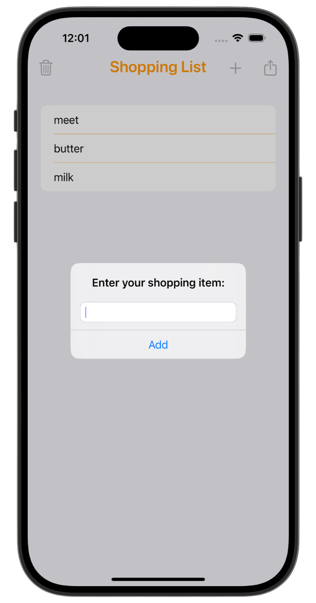
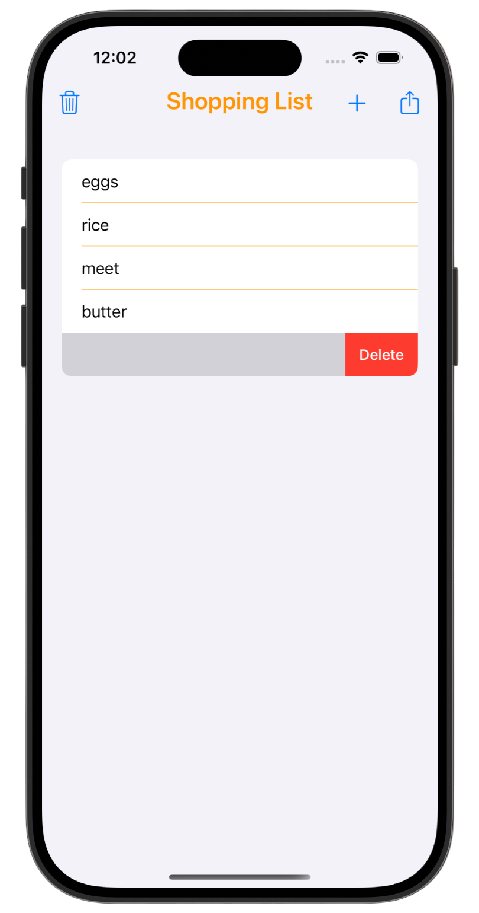
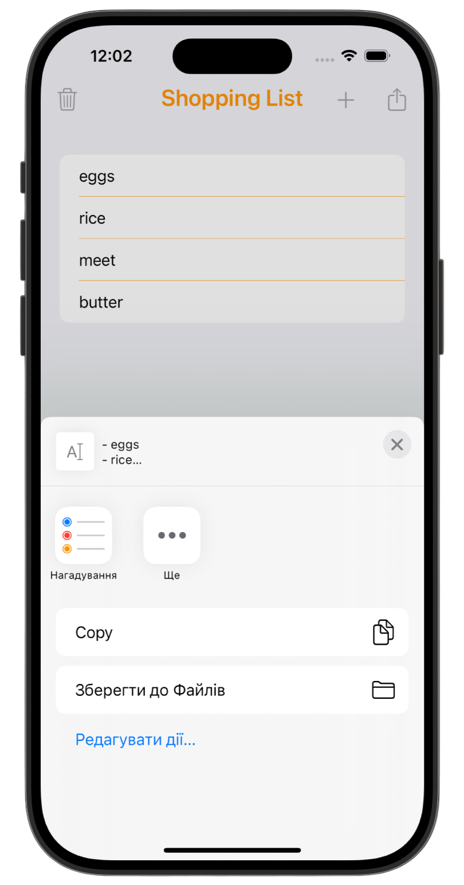

# Shopping List 🧾

[Milestone project 2](https://www.hackingwithswift.com/100/32) from the [100 Days of Swift course](https://www.hackingwithswift.com/100) by [Hacking With Swift](https://www.hackingwithswift.com/).

>A simple iOS shopping list app that lets users quickly add, manage, and clear items — practicing text input, table views, alerts, and basic data handling in Swift.

---

## Functionality 🧩
- ➕ Add items to the shopping list via an alert with text input  
- 📋 Display items in a `UITableView`  
- 🗑 Delete items with swipe actions (`UISwipeActionsConfiguration`)
- ♻️ Clear the entire list with a single tap
- 📤 Share the full shopping list via `UIActivityViewController`
- 🎨 Custom navigation bar appearance (title font & color)

---

## Screenshots

<div align="center">
  
  
  
</div>

---

## Lesson Overview / Learning Progress

|                      Day                      | Contents                                                                                                                                                                                                          |
|:---------------------------------------------:|:------------------------------------------------------------------------------------------------------------------------------------------------------------------------------------------------------------------|
| [32](https://www.hackingwithswift.com/100/32) | <ul><li>[What you learned](https://www.hackingwithswift.com/guide/3/1)</li><li>[Key points](https://www.hackingwithswift.com/guide/3/2)</li><li>[Challenge](https://www.hackingwithswift.com/guide/3/3)</li></ul> |

---

## Challenge Instructions

*Instructions taken from [here](https://www.hackingwithswift.com/guide/3/3).* 

>It’s time to put your skills to the test by making your own complete app from scratch. This time your job is to create an app that lets people create a shopping list by adding items to a table view.
>
>The best way to tackle this app is to think about how you build project 5: it was a table view that showed items from an array, and we used a UIAlertController with a text field to let users enter free text that got appended to the array. That forms the foundation of this app, except this time you don’t need to validate items that get added – if users enter some text, assume it’s a real product and add it to their list.
>
>For bonus points, add a left bar button item that clears the shopping list – what method should be used afterwards to make the table view reload all its data?
>
>Here are some hints in case you hit problems:
>
>- Remember to change `ViewController` to build on `UITableViewController`, then change the storyboard to match.
>- Create a `shoppingList´ property of type `[String]` to hold all the items the user wants to buy.
>- Create your `UIAlertController` with the style `.alert`, then call `addTextField()` to let the user enter text.
>- When you have a new shopping list item, make sure you `insert()` it into your `shoppingList` array before you call the `insertRows(at:)` method of your table view – your app will crash if you do this the wrong way around.
>
>You might be tempted to try to use UIActivityViewController to share the finished shopping list by email, but if you do that you’ll hit a problem: you have an array of strings, not a single string.
>
>There’s a special method that can create one string from an array, by stitching each part together using a separator you provide. I’ll be going into it in project 8, but if you’re keen to try it now here’s some code to get you started:
>
>```Swift
>let list = shoppingList.joined(separator: "\n")
>```
>
>That will create a new `list` constant that is a regular string, with each shopping list item separated by “\n” – that’s Swift’s way of representing a new line.

---

## Installation

1. Clone this repository:  
   ```bash
   git clone https://github.com/gurman-man/100-days-of-swift.git
   ```
2. Open `Challenge2.xcodeproj` in Xcode
3. Run on the simulator or your device
