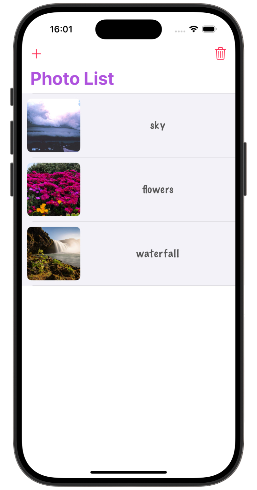
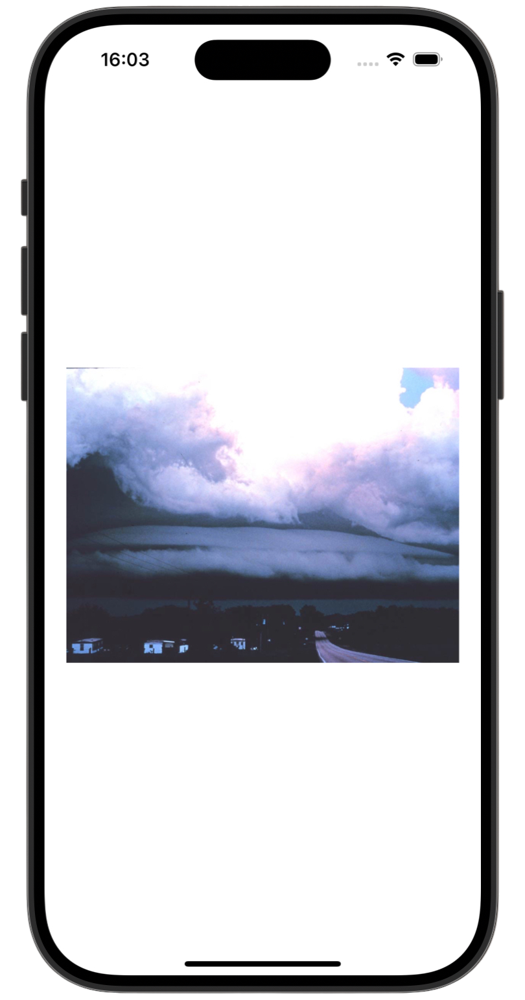
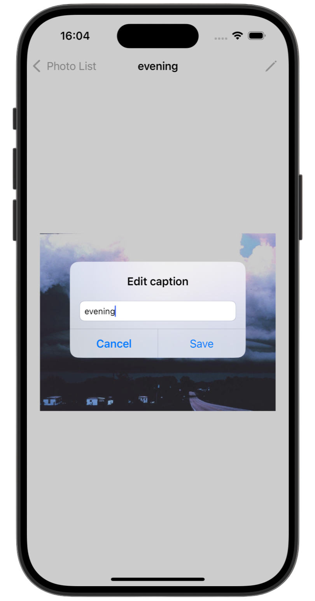
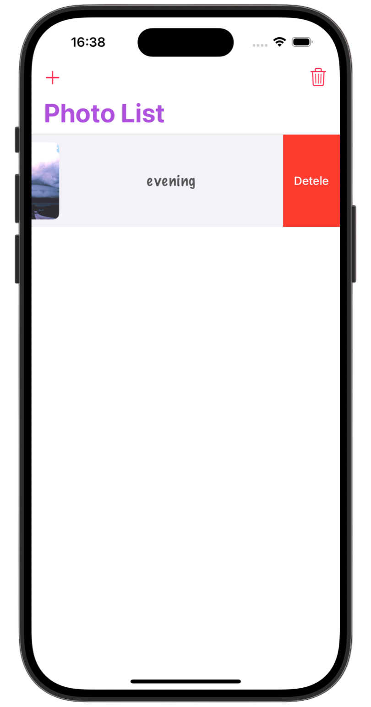

# Photo List 📷

[Milestone project 4](https://www.hackingwithswift.com/guide/5/1) from the [100 Days of Swift course](https://www.hackingwithswift.com/100) by [Hacking With Swift](https://www.hackingwithswift.com/).

>A simple iOS photo journal app that lets users import photos, add captions, edit them, and save everything using UserDefaults and the app's Documents directory. Features a table-based gallery, photo picker, caption editing, and swipe-to-delete support.

---

## Functionality 🧩
- 🖼 Add photos from library with captions
- 📦 Save images locally & store captions with `UserDefaults`
- 📋 Display photos in a list with preview
- 🔍 Open photo in detail view
- 📝 Edit caption in detail screen
- 🗑 Swipe to delete photos or clear all

---

## Screenshots

<div align="center">
  
  
  
  
</div>

---

## Lesson Overview / Learning Progress

|                      Day                      | Contents                                                                                                                                                                                                          |
|:---------------------------------------------:|:------------------------------------------------------------------------------------------------------------------------------------------------------------------------------------------------------------------|
| [50](https://www.hackingwithswift.com/100/50) | <ul><li>[What you learned](https://www.hackingwithswift.com/guide/5/1)</li><li>[Key points](https://www.hackingwithswift.com/guide/5/2)</li><li>[Challenge](https://www.hackingwithswift.com/guide/5/3)</li></ul> |

---

## Challenge Instructions

*Instructions taken from [here](https://www.hackingwithswift.com/guide/5/3).*

>Your challenge is to put two different projects into one: I’d like you to let users take photos of things that interest them, add captions to them, then show those photos in a table view. Tapping the caption should show the picture in a new view controller, like we did with project 1. So, your finished project needs to use elements from both project 1 and project 12, which should give you ample chance to practice.
>
>This will require you to use the `picker.sourceType = .camera` setting for your image picker controller, create a custom type that stores a filename and a caption, then show the list of saved pictures in a table view. Remember: using the camera is only possible on a physical device.
>
>It might sound counter-intuitive, but trust me: one of the best ways to learn things deeply is to learn them, forget them, then learn them again. So, don’t be worried if there are some things you don’t recall straight away: straining your brain for them, or perhaps re-reading an older chapter just briefly, is a great way to help your iOS knowledge sink in a bit more.
>
>Here are some hints in case you hit problems:
>
>- You’ll need to make `ViewController` build on `UITableViewController` rather than just `UIViewController`.
>- Just like in project 10, you should create a custom type that stores an image filename and a caption string, then use either `Codable` or `NSCoding` to load and save that.
>- Use a `UIAlertController` to get the user’s caption for their image – a single text field is enough.
>- You’ll need to design your detail view controller using Interface Builder, then call `instantiateViewController` to load it when a table view row is tapped.

---

## Installation

1. Clone this repository:  
   ```bash
   git clone https://github.com/gurman-man/100-days-of-swift.git
   ```
2. Open `Consolidation5_PhotoList.xcodeproj` in Xcode
3. Run on the simulator or your device
