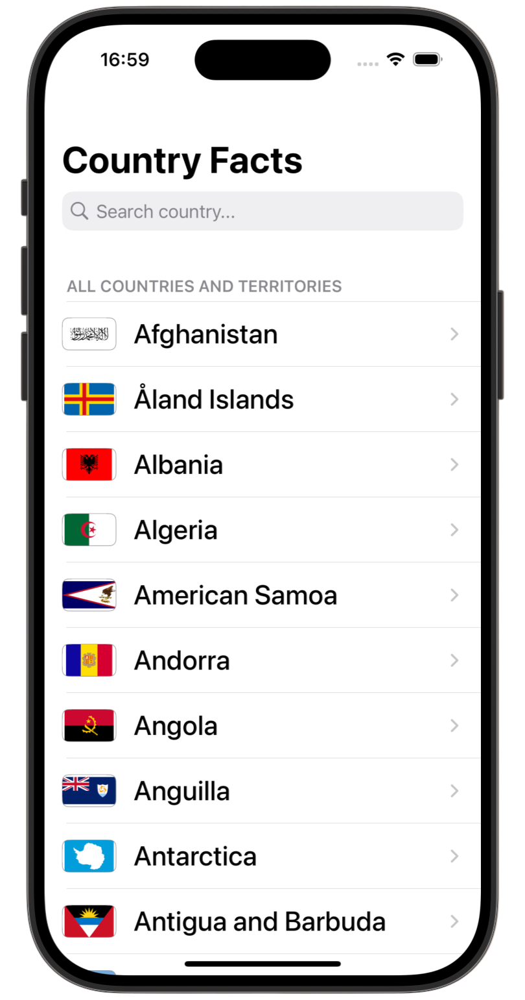
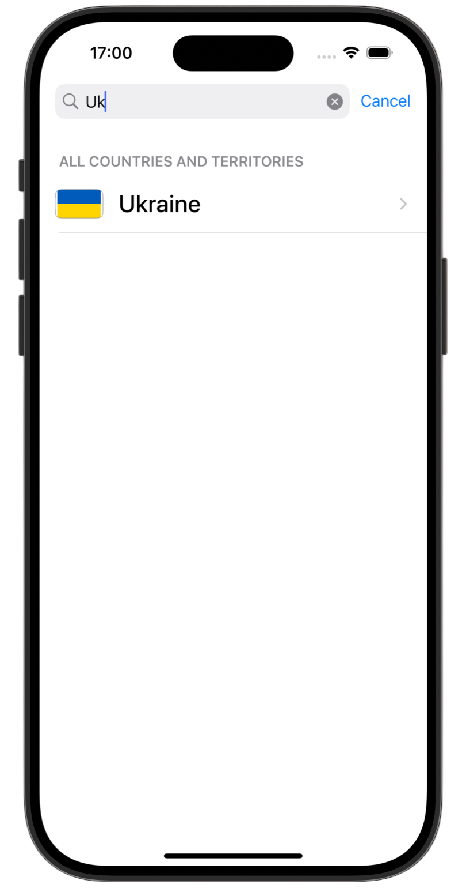
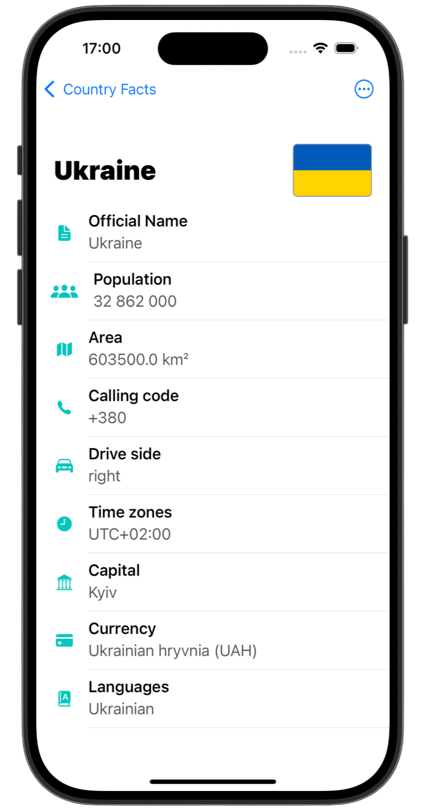
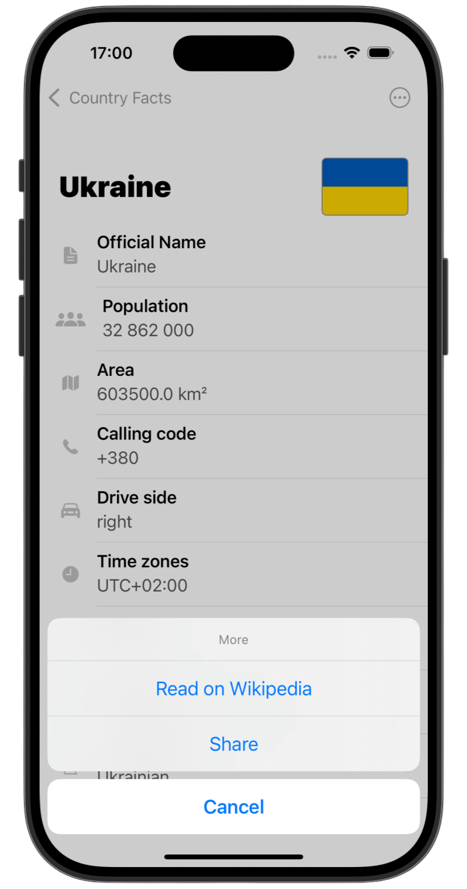

# Country Facts

[Milestone project 5](https://www.hackingwithswift.com/guide/6/1) from the [100 Days of Swift course](https://www.hackingwithswift.com/100) by [Hacking With Swift](https://www.hackingwithswift.com/).

>iOS app that loads and displays country data from API with search, detail view, async images, and Wikipedia integration.

---

## 🧩 Functionality

- 🌍 Fetch country data from REST API  
- 🧾 Display list of countries with flags  
- 🔍 Search countries using `UISearchController`  
- ➡️ Show detailed country info screen  
- 📎 Open Wikipedia in `SFSafariViewController`  
- 📤 Share country info via `UIActivityViewController`

---

## Screenshots

<div align="center">
  
  
  
  
</div>

---

## Lesson Overview / Learning Progress

|                      Day                      | Contents                                                                                                                                                                                                          |
|:---------------------------------------------:|:------------------------------------------------------------------------------------------------------------------------------------------------------------------------------------------------------------------|
| [59](https://www.hackingwithswift.com/100/59) | <ul><li>[What you learned](https://www.hackingwithswift.com/guide/6/1)</li><li>[Key points](https://www.hackingwithswift.com/guide/6/2)</li><li>[Challenge](https://www.hackingwithswift.com/guide/6/3)</li></ul> |

---

## Challenge Instructions

*Instructions taken from [here](https://www.hackingwithswift.com/guide/6/3).*

>Your challenge is to make an app that contains facts about countries: show a list of country names in a table view, then when one is tapped bring in a new screen that contains its capital city, size, population, currency, and any other facts that interest you. The type of facts you include is down to you – Wikipedia has a huge selection to choose from.
>
>To make this app, I would recommend you blend parts of project 1 project 7. That means showing the country names in a table view, then showing the detailed information in a second table view.
>
>How you load data into the app is going to be an interesting problem for you to solve. I suggested project 7 above because a sensible approach would be to create a JSON file with your facts in, then load that in using `contentsOf` and parse it using `Codable`. Regardless of how you end up solving this, I suggest you don’t just hard-code it into the app – i.e., typing all the facts manually into your Swift code. You’re better than that!
>
> Go ahead and try coding it now. If you hit problems, here are some hints:
>
>- You should create a custom `Country` struct that has properties for each of the facts you have in your JSON file. You can then have a `[Country]` array in your view controller.
>- When using a table view in your detail view controller, try setting the `numberOfLines` property of the cell’s text label to be 0. That ought to allow the cell to fill up to two lines of text by default.
>- Don’t forget all the little UI touches: adding a disclosure indicator to the countries table, adding titles to the navigation controller, and so on. You could even add an action button to the detail view that shares a fact about the selected country.

---

## Installation

1. Clone this repository:  
   ```bash
   git clone https://github.com/gurman-man/100-days-of-swift.git
   ```
2. Open `CountryFacts.xcodeproj` in Xcode
3. Run on the simulator or your device
