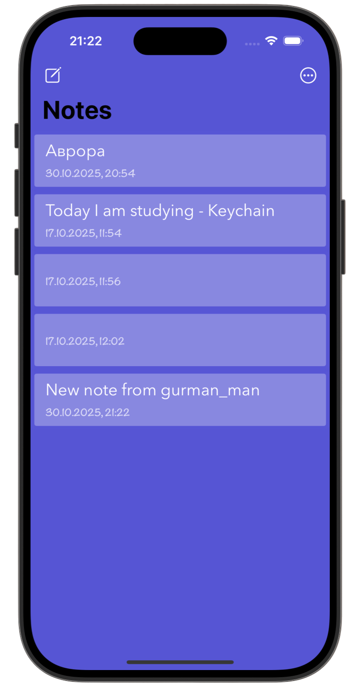
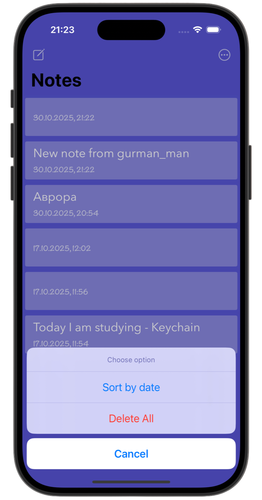
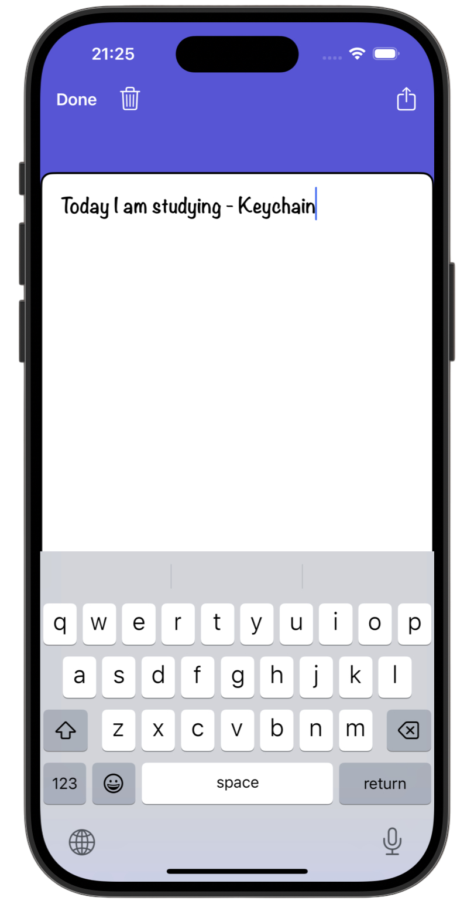
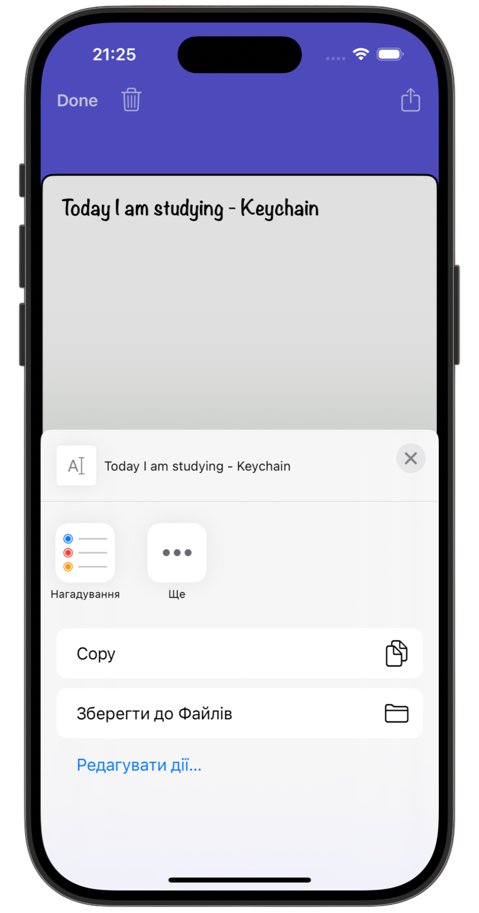

# Notes 📝

[Milestone project 7](https://www.hackingwithswift.com/guide/8/1) from the [100 Days of Swift course](https://www.hackingwithswift.com/100) by [Hacking With Swift](https://www.hackingwithswift.com/).

>iOS notes app with create, edit, delete, sort, and share features, using persistent storage and a rich text interface.

---

## Functionality 🧩 

- 🗂 Create, edit & delete notes  
- 📅 Sort notes by date  
- 🖊 Rich text editing in detail view  
- 📤 Share notes via system sheet  
- 💾 Persistent storage with UserDefaults  
- 👆 Swipe to delete & tap to edit

---

## Screenshots

<div align="center">
  
  
  
  
</div>

## Lesson Overview / Learning Progress

|                      Day                      | Contents                                                                                                                                                                                                          |
|:---------------------------------------------:|:------------------------------------------------------------------------------------------------------------------------------------------------------------------------------------------------------------------|
| [74](https://www.hackingwithswift.com/100/74) | <ul><li>[What you learned](https://www.hackingwithswift.com/guide/8/1)</li><li>[Key points](https://www.hackingwithswift.com/guide/8/2)</li><li>[Challenge](https://www.hackingwithswift.com/guide/8/3)</li></ul> |

---

## Challenge Instructions

*Instructions taken from [here](https://www.hackingwithswift.com/guide/8/3/challenge).*

>Have you ever heard the phrase, “imitation is the highest form of flattery”? I can’t think of anywhere it’s more true than on iOS: Apple sets an extremely high standard for apps, and encourages us all to follow suit by releasing a vast collection of powerful, flexible APIs to work with.
>
>Your challenge for this milestone is to use those API to imitate Apple as closely as you can: I’d like you to recreate the iOS Notes app. I suggest you follow the iPhone version, because it’s fairly simple: a navigation controller, a table view controller, and a detail view controller with a full-screen text view.
>
>How much of the app you imitate is down to you, but I suggest you work through this list:
>
>1. Create a table view controller that lists notes. Place it inside a navigation controller. (Project 1)
>2. Tapping on a note should slide in a detail view controller that contains a full-screen text view. (Project 19)
>3. Notes should be loaded and saved using Codable. You can use UserDefaults if you want, or write to a file. (Project 12)
>4. Add some toolbar items to the detail view controller – “delete” and “compose” seem like good choices. (Project 4)
>5. Add an action button to the navigation bar in the detail view controller that shares the text using UIActivityViewController. (Project 3)
>
>Once you’ve done those, try using Interface Builder to customize the UI – how close can you make it look like Notes?
>
>Note: the official Apple Notes app supports rich text input and media; don’t worry about that, focus on plain text.
>
>Go ahead and try now. Remember: don’t fret if it sounds hard – it’s supposed to stretch you.
>
>Here are some hints in case you hit a problem:
>
>- You could represent each note using a custom Note class if you wanted, but to begin with perhaps just make each note a string that gets stored in a notes array.
>- If you do intend to go down the custom class route for notes, make sure you conform to Codable – you might need to re-read project 12.
>- Make sure you use NotificationCenter to update the insets for your detail text view when the keyboard is shown or hidden.
>- Try changing the tintColor property in Interface Builder. This controls the color of icons in the navigation bar and toolbar, amongst other things.

---

## Installation

1. Clone this repository:  
   ```bash
   git clone https://github.com/gurman-man/100-days-of-swift.git
   ```
2. Open `Notes.xcodeproj` in Xcode
3. Run on the simulator or your device

