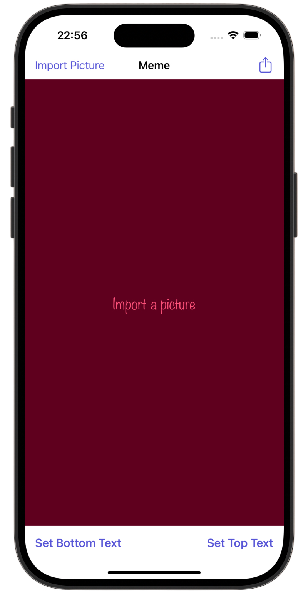
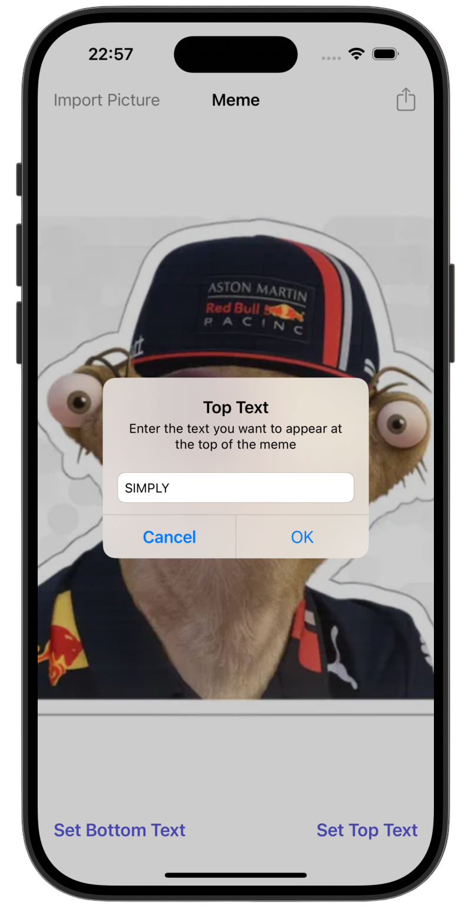
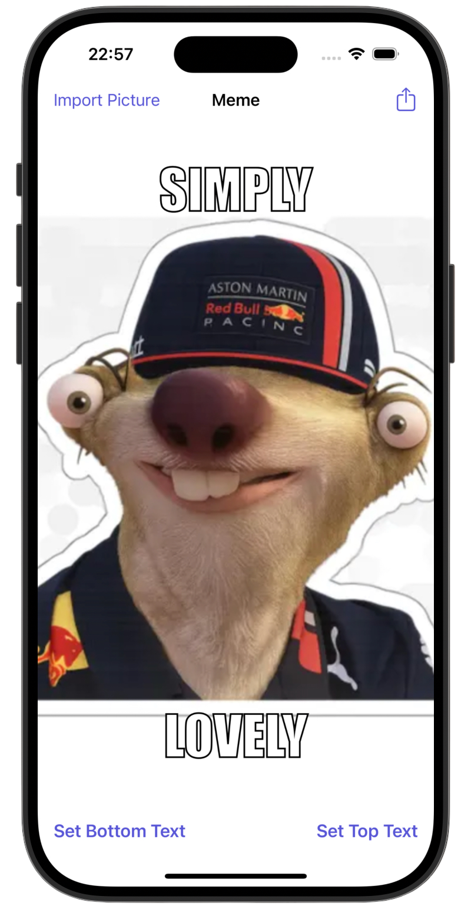

# Meme Generator 🏎️

[Milestone project 9](https://www.hackingwithswift.com/100/90) from the [100 Days of Swift course](https://www.hackingwithswift.com/100) by [Hacking With Swift](https://www.hackingwithswift.com/).

>A simple iOS app that allows users to create classic meme-style images by importing photos and adding customizable top and bottom text. Text is rendered directly onto the image using Core Graphics, replicating traditional meme style with bold fonts, centered layout, and stroke effects.

---

## Functionality 🧩

- 🖼 Import image from photo library  
- ✍️ Add top & bottom meme text via alerts  
- 🧠 Text rendering on image using `UIGraphicsImageRenderer`  
- 📐 Impact-style meme font with stroke & alignment  
- 📤 Share final meme via `UIActivityViewController`  
- 🛠 Toolbar controls for easy text input 

---

## Screenshots

<div align="center">
  
  
  
</div>

---

## Lesson Overview / Learning Progress

|                      Day                      | Contents                                                                                                                                                                                                          |
|:---------------------------------------------:|:------------------------------------------------------------------------------------------------------------------------------------------------------------------------------------------------------------------|
| [90](https://www.hackingwithswift.com/100/90) | <ul><li>[What you learned](https://www.hackingwithswift.com/guide/10/1)</li><li>[Key points](https://www.hackingwithswift.com/guide/10/2)</li><li>[Challenge](https://www.hackingwithswift.com/guide/10/3)</li></ul> |

---

## Challenge Instructions

*Instructions taken from [here](https://www.hackingwithswift.com/guide/10/3/challenge).*

>Your challenge for this milestone is to create a meme generation app using UIImagePickerController, UIAlertController, and Core Graphics. If you aren’t familiar with them, memes are a simple format that shows a picture with one line of text overlaid at the top and another overlaid at the bottom.
>
>Your app should:
>
>- Prompt the user to import a photo from their photo library.
>- Show an alert with a text field asking them to insert a line of text for the top of the meme.
>- Show a second alert for the bottom of the meme.
>- Render their image plus both pieces of text into one finished UIImage using Core Graphics.
>- Let them share that result using UIActivityViewController.
>
>Both the top and bottom pieces of text should be optional; the user doesn’t need to provide them if they don’t want to.
>
>Try to solve the challenge now. As per usual, there are some hints below in case you hit problems.
>
>1. Your UI can be pretty simple: a large image view, with three buttons below: Import Picture, Set Top Text, and Set Bottom Text.
>2. Both pieces of text can be read in using a UIAlertController with a text field inside.
>3. When rendering your finished image, make sure you draw your UIImage first, then add the text on top.
>4. NSAttributedString has keys to specify the stroke width and color of text, which would make it more readable – can you experiment to figure it out?

---

## Installation

1. Clone this repository:  
   ```bash
   git clone https://github.com/gurman-man/100-days-of-swift.git
   ```
2. Open `MemeGenerationApp.xcodeproj` in Xcode
3. Run on the simulator or your device
