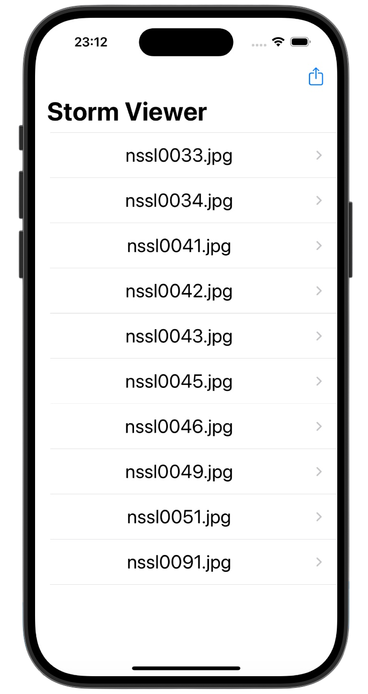
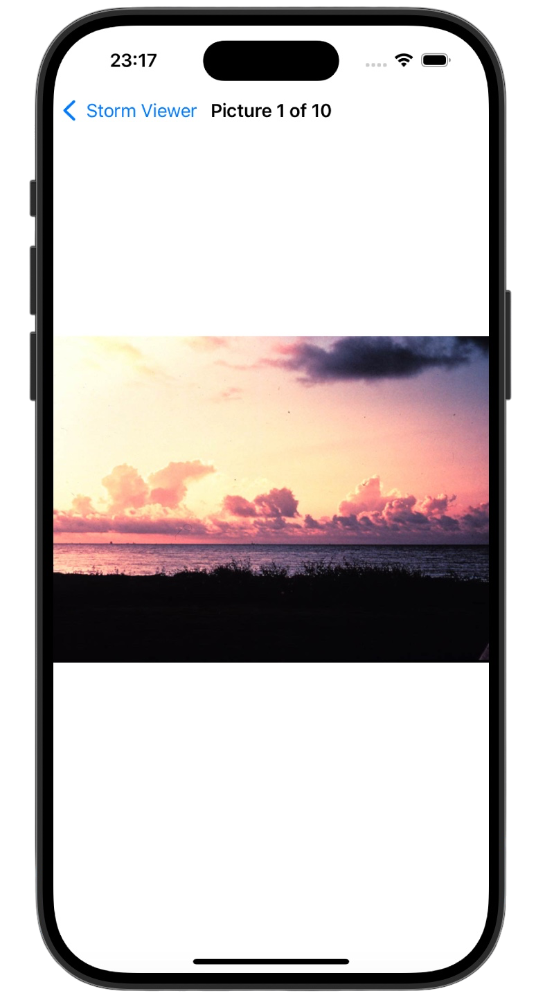

# Storm Viewer 🌩️

[Project 1](https://www.hackingwithswift.com/read/1/overview) from the [100 Days of Swift course](https://www.hackingwithswift.com/100) by [Hacking With Swift](https://www.hackingwithswift.com/).
A simple iOS app that displays a list of storm images and allows users to view them in detail.

## Contents

|                      Day                      | Contents                                                                                                                                                                                                                                                                                                                                                                    |
|:---------------------------------------------:|:----------------------------------------------------------------------------------------------------------------------------------------------------------------------------------------------------------------------------------------------------------------------------------------------------------------------------------------------------------------------------|
| [16](https://www.hackingwithswift.com/100/16) | <ul><li>[Setting up](https://www.hackingwithswift.com/read/1/1/setting-up)</li><li>[Listing images with FileManager](https://www.hackingwithswift.com/read/1/2/listing-images-with-filemanager)</li><li>[Designing our interface](https://www.hackingwithswift.com/read/1/3/designing-our-interface)</li></ul>                                                              |
| [17](https://www.hackingwithswift.com/100/17) | <ul><li>[Building a detail screen](https://www.hackingwithswift.com/read/1/4/building-a-detail-screen)</li><li>[Loading images with UIImage](https://www.hackingwithswift.com/read/1/5/loading-images-with-uiimage)</li><li>[Final tweaks: hidesBarsOnTap, safe area margins](https://www.hackingwithswift.com/read/1/6/final-tweaks-hidesbarsontap-safe-area-margins)</li> | 
| [18](https://www.hackingwithswift.com/100/18) | <ul><li>[Wrap up](https://www.hackingwithswift.com/read/1/6/wrap-up)</li><li>[Review for Project 1: Storm Viewer](https://www.hackingwithswift.com/review/hws/project-1-storm-viewer)</li>                                                                                                                                                                                  |


## Challenges

Taken from [here](https://www.hackingwithswift.com/read/1/7/wrap-up):

>1. Use Interface Builder to select the text label inside your table view and adjust its size to something larger
>2. In your main table view, show the image names in sorted order, so "nssl0033.jpg" comes before "nssl0034.jpg".
>3. Rather than show image names in the detail title bar, show "Picture X of Y", where Y is the total number of images and X is the picture's position in the array. Make sure you count from 1 rather than 0.

## Screenshots

<div align="center">
  
  
</div>

---

## Installation

1. Clone this repository:  
   ```bash
   git clone https://github.com/gurman-man/100-days-of-swift.git
   ```
2. Open `Project1.xcodeproj` in Xcode
3. Run on the simulator or your device
