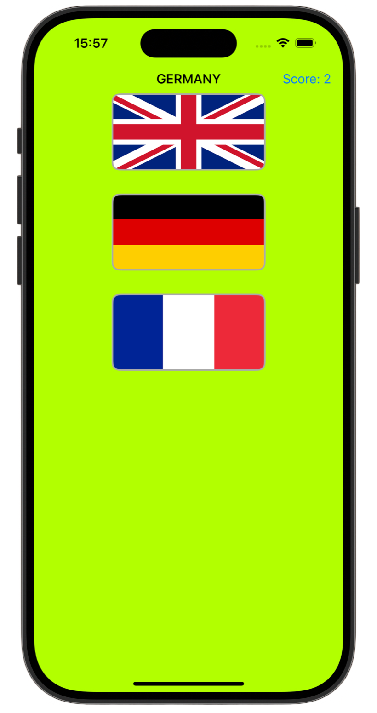
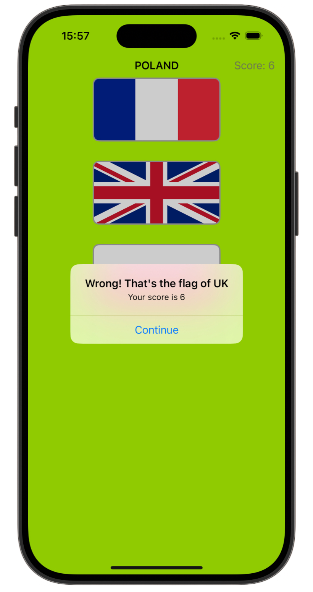
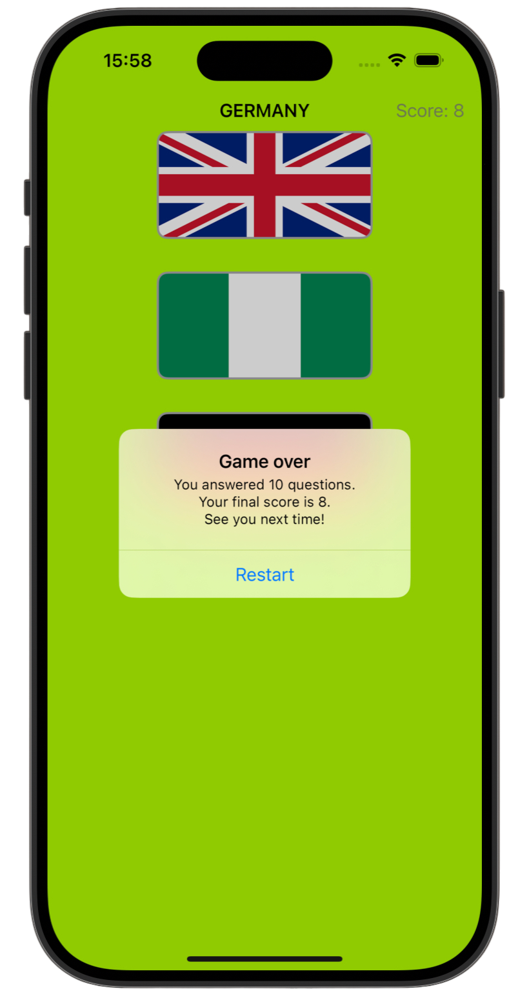

# 🤔 Guess The Flag 🤔

[Project 2](https://www.hackingwithswift.com/read/2/overview) from the [100 Days of Swift course](https://www.hackingwithswift.com/100) by [Hacking With Swift](https://www.hackingwithswift.com/).  

An iOS flag-guessing game that lets users choose the correct country flag and keeps score across 10 questions.

## Contents

| Day                                           | Contents                                                                                                                                                                                                                                                                                                                                    |
|-----------------------------------------------|---------------------------------------------------------------------------------------------------------------------------------------------------------------------------------------------------------------------------------------------------------------------------------------------------------------------------------------------|
| [19](https://www.hackingwithswift.com/100/19) | <ul><li>[Setting up](https://www.hackingwithswift.com/read/2/1/setting-up)</li><li>[Designing your layout](https://www.hackingwithswift.com/read/2/2/designing-your-layout)</li><li>[Making the basic game work: UIButton and CALayer](https://www.hackingwithswift.com/read/2/3/making-the-basic-game-work-uibutton-and-calayer)</li></ul> |
| [20](https://www.hackingwithswift.com/100/20) | <ul><li>[Guess which flag: random numbers](https://www.hackingwithswift.com/read/2/4/guess-which-flag-random-numbers)</li><li>[From outlets to actions: creating an IBAction](https://www.hackingwithswift.com/read/2/5/from-outlets-to-actions-creating-an-ibaction)</li>                                                                  | 
| [21](https://www.hackingwithswift.com/100/21) | <ul><li>[Wrap up](https://www.hackingwithswift.com/read/2/6/wrap-up)</li><li>[Review for Project 2: Guess the Flag](https://www.hackingwithswift.com/review/hws/project-2-guess-the-flag)</li>                                                                                                                                              |


## Challenges

Taken from [here](https://www.hackingwithswift.com/read/2/6/wrap-up):

>1. Try showing the player's score in the navigation bar, alongside the flag to guess.
>2. Keep track of how many questions have been asked, and show one final alert controller after they have answered 10. This should show their final score.
>3. When someone chooses the wrong flag, tell them their mistake in your alert message – something like “Wrong! That’s the flag of France,” for example.

## Screenshots

<div align="center">
  
  
  
</div>

---

## Installation

1. Clone this repository:  
   ```bash
   git clone https://github.com/gurman-man/100-days-of-swift.git
   ```
2. Open `Project2.xcodeproj` in Xcode
3. Run on the simulator or your device
