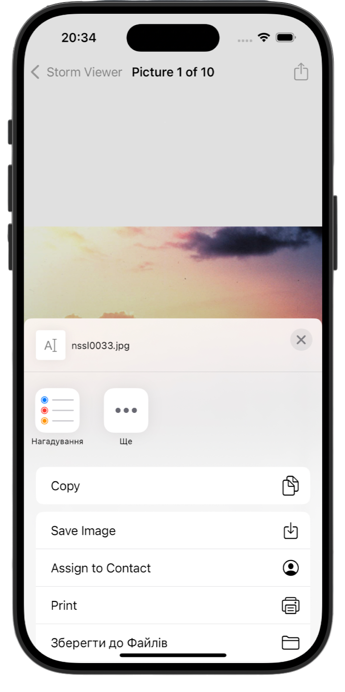

# Social Media 👪

[Project 3](https://www.hackingwithswift.com/read/3/overview) from the [100 Days of Swift course](https://www.hackingwithswift.com/100) by [Hacking With Swift](https://www.hackingwithswift.com/).

>An enhanced Storm Viewer app that lets users share images and their names via the activityItems array (except Facebook, which doesn’t allow text).

## Contents

| Day                                           | Contents                                                                                                                                                                                                                                                                                                                                                                                                                          |
|-----------------------------------------------|-----------------------------------------------------------------------------------------------------------------------------------------------------------------------------------------------------------------------------------------------------------------------------------------------------------------------------------------------------------------------------------------------------------------------------------|
| [22](https://www.hackingwithswift.com/100/22) | <ul><li>[About technique projects](https://www.hackingwithswift.com/read/3/1/about-technique-projects)</li><li>[UIActivityViewController explained](https://www.hackingwithswift.com/read/3/2/uiactivityviewcontroller-explained)</li><li>[Wrap up](https://www.hackingwithswift.com/read/3/3/wrap-up)</li><li>[Review for Project 3: Social media](https://www.hackingwithswift.com/review/hws/project-3-social-media)</li></ul> |


## Challenges

Taken from [here](https://www.hackingwithswift.com/read/3/3/wrap-up):

>1. Try adding the image name to the list of items that are shared. The activityItems parameter is an array, so you can add strings and other things freely. Note: Facebook won’t let you share text, but most other share options will.
>2. Go back to project 1 and add a bar button item to the main view controller that recommends the app to other people.
>3. Go back to project 2 and add a bar button item that shows their score when tapped.

## Screenshots

<div align="center">
  
</div>

---

## Installation

1. Clone this repository:  
   ```bash
   git clone https://github.com/gurman-man/100-days-of-swift.git
   ```
2. Open `Project3.xcodeproj` in Xcode
3. Run on the simulator or your device
