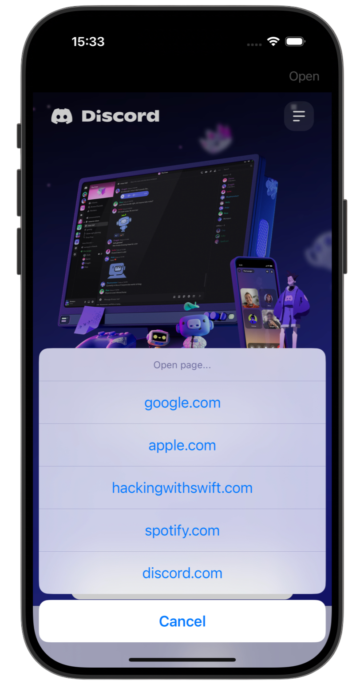

# 🌐 Lite Browser 🌐

[Project 4](https://www.hackingwithswift.com/read/4/overview) from the [100 Days of Swift course](https://www.hackingwithswift.com/100) by [Hacking With Swift](https://www.hackingwithswift.com/).

>A simple iOS web browser app that lets users open and navigate a predefined list of websites, with a progress bar, back/forward buttons, and restricted access to only allowed sites.

## Contents

|                      Day                      | Contents                                                                                                                                                                                                                                                                                    |
|:---------------------------------------------:|:--------------------------------------------------------------------------------------------------------------------------------------------------------------------------------------------------------------------------------------------------------------------------------------------|
| [24](https://www.hackingwithswift.com/100/24) | <ul><li>[Setting up](https://www.hackingwithswift.com/read/4/1/setting-up)</li><li>[Creating a simple browser with WKWebView](https://www.hackingwithswift.com/read/4/2)</li><li>[Choosing a website: UIAlertController action sheets](https://www.hackingwithswift.com/read/4/3)</li></ul> |
| [25](https://www.hackingwithswift.com/100/25) | <ul><li>[Monitoring page loads: UIToolbar and UIProgressView](https://www.hackingwithswift.com/read/4/4)</li><li>[Refactoring for the win](https://www.hackingwithswift.com/read/4/5)</li>                                                                                                  | 
| [26](https://www.hackingwithswift.com/100/26) | <ul><li>[Wrap up](https://www.hackingwithswift.com/read/4/6/wrap-up)</li><li>[Review for Project 4: Easy Browser](https://www.hackingwithswift.com/review/hws/project-4-easy-browser)</li>                                                                                                  |


## Challenges

Taken from [here](https://www.hackingwithswift.com/read/4/6/wrap-up):

>1. If users try to visit a URL that isn’t allowed, show an alert saying it’s blocked.
>2. Try making two new toolbar items with the titles Back and Forward. You should make them use `webView.goBack` and `webView.goForward`.
>3. For more of a challenge, try changing the initial view controller to a table view like in project 1, where users can choose their website from a list rather than just having the first in the array loaded up front.

## Screenshots

<div align="center">
  
  
  
</div>

---

## Installation

1. Clone this repository:  
   ```bash
   git clone https://github.com/gurman-man/100-days-of-swift.git
   ```
2. Open `Project4.xcodeproj` in Xcode
3. Run on the simulator or your device
