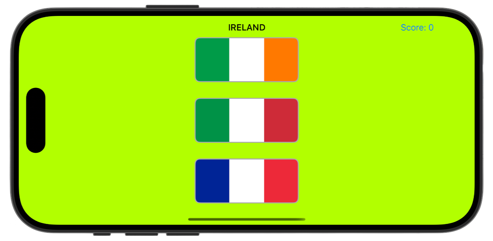

# Project 6a - Auto Layout

[Project6a](https://www.hackingwithswift.com/read/6/2/advanced-auto-layout) from the [100 Days of Swift course](https://www.hackingwithswift.com/100) by [Hacking With Swift](https://www.hackingwithswift.com/).

## Contents

Auto Layout, Constraints, Visual Format Language

## Screenshots

  

