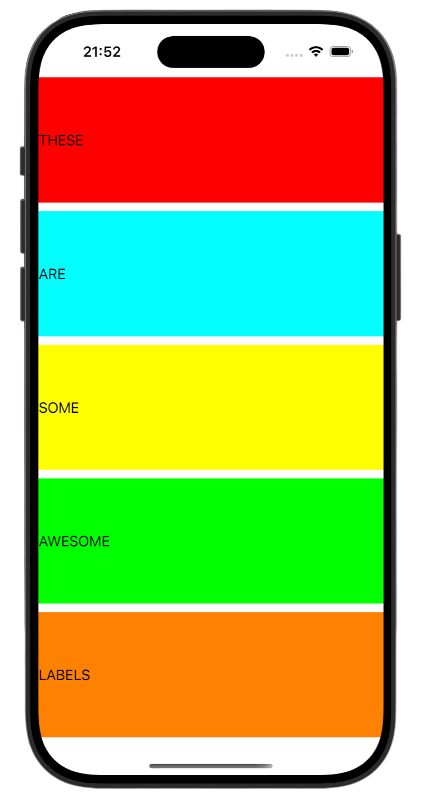
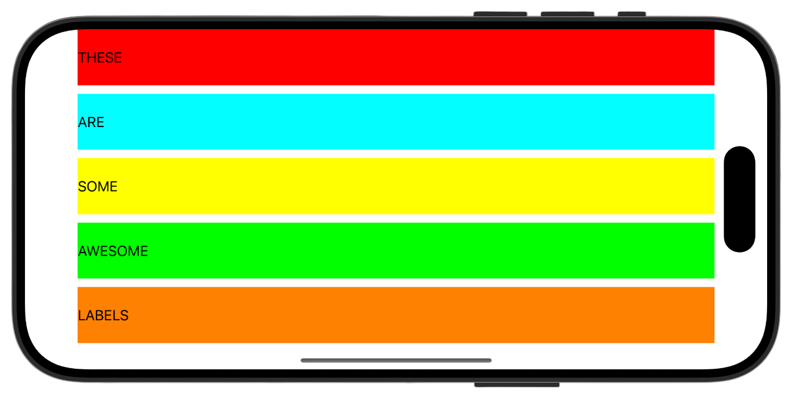

# Project 6b - Auto Layout

[Project6b](https://www.hackingwithswift.com/read/6/3/auto-layout-in-code-addconstraints-with-visual-format-language) from the [100 Days of Swift course](https://www.hackingwithswift.com/100) by [Hacking With Swift](https://www.hackingwithswift.com/).

## Contents

Auto Layout, Constraints, Visual Format Language

## Screenshots

  
  

