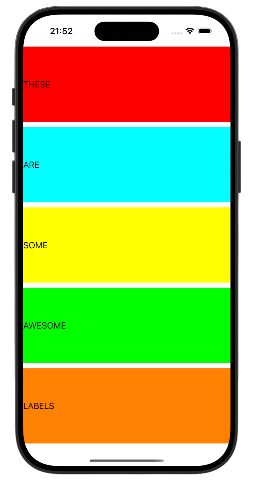
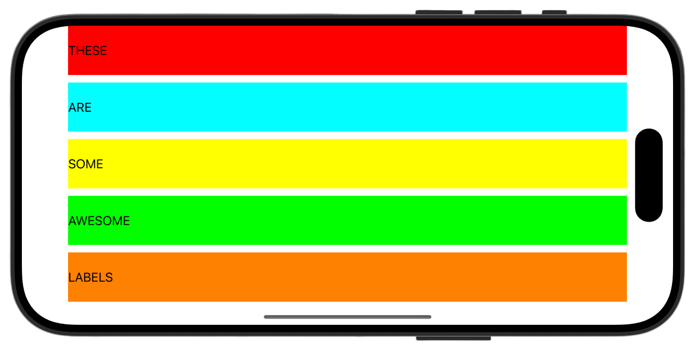

# Project 6 - Auto Layout 🔧💻🛠️

[Project 6](https://www.hackingwithswift.com/read/6/overview) from the [100 Days of Swift course](https://www.hackingwithswift.com/100) by [Hacking With Swift](https://www.hackingwithswift.com/).

>A basic iOS app demonstrating how to create and manage Auto Layout constraints programmatically.
>This project is divided in [Project 6a](Project6a/) and [Project 6b](Project6b/) projects.

## Contents

|                      Day                      | Contents                                                                                                                                                                                                                                                                                                                                                                    |
|:---------------------------------------------:|:----------------------------------------------------------------------------------------------------------------------------------------------------------------------------------------------------------------------------------------------------------------------------------------------------------------------------------------------------------------------------|
| [30](https://www.hackingwithswift.com/100/30) | <ul><li>[Setting up](https://www.hackingwithswift.com/read/6/1/setting-up)</li><li>[Advanced Auto Layout](https://www.hackingwithswift.com/read/6/2/advanced-auto-layout)</li><li>[Auto Layout in code: addConstraints() with Visual Format Language](https://www.hackingwithswift.com/read/6/3/auto-layout-in-code-addconstraints-with-visual-format-language)</li></ul>                                                              |
| [31](https://www.hackingwithswift.com/100/31) | <ul><li>[Auto Layout metrics and priorities: constraints(withVisualFormat:)](https://www.hackingwithswift.com/read/6/4/auto-layout-metrics-and-priorities-constraintswithvisualformat)</li><li>[Auto Layout anchors](https://www.hackingwithswift.com/read/6/5/auto-layout-anchors)</li><li>[Wrap up](https://www.hackingwithswift.com/read/6/6/wrap-up)</li><li>[Review for Project 6: Auto Layout](https://www.hackingwithswift.com/review/hws/project-6-auto-layout)</li></ul>                                                              |


## Challenges

>1. Try replacing the widthAnchor of our labels with leadingAnchor and trailingAnchor constraints, which more explicitly pin the label to the edges of its parent.
>2. Once you’ve completed the first challenge, try using the safeAreaLayoutGuide for those constraints. You can see if this is working by rotating to landscape, because the labels won’t go under the safe area.
>3. Try making the height of your labels equal to 1/5th of the main view, minus 10 for the spacing. This is a hard one, but I’ve included hints below!

## Screenshots

<div align="center">
  
  
</div>

---

## Installation

1. Clone this repository:  
   ```bash
   git clone https://github.com/gurman-man/100-days-of-swift.git
   ```
2. Open `Project6a.xcodeproj` or `Project6b.xcodeproj` in Xcode
3. Run on the simulator or your device
