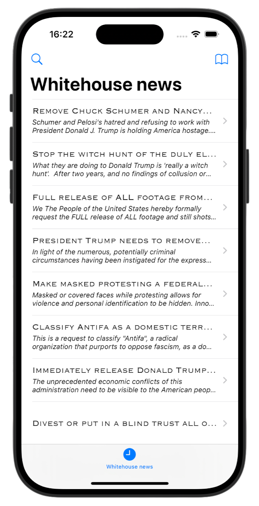
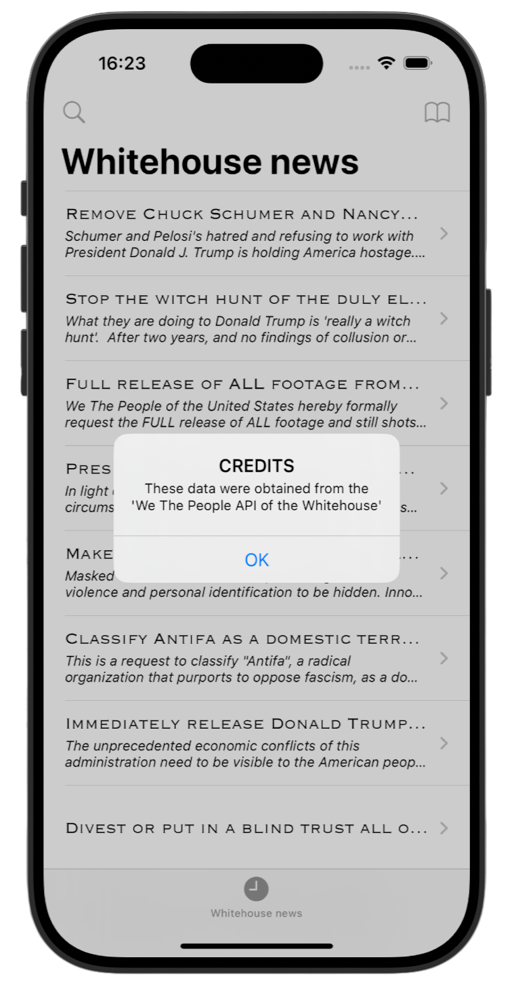
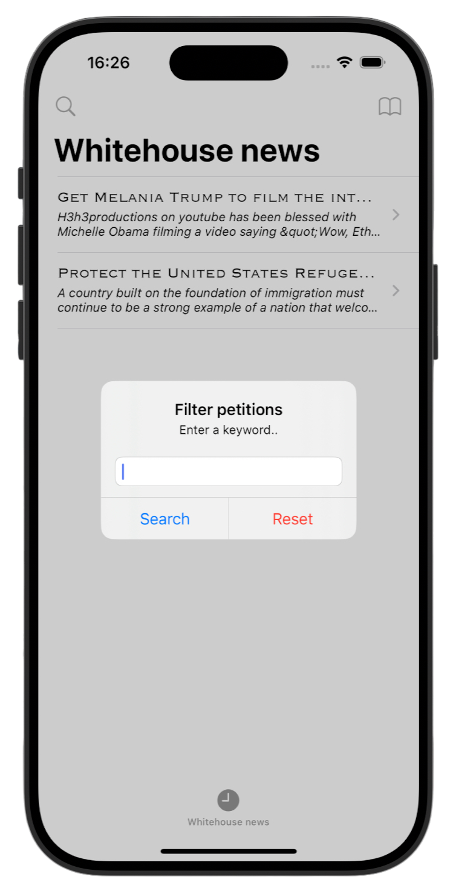
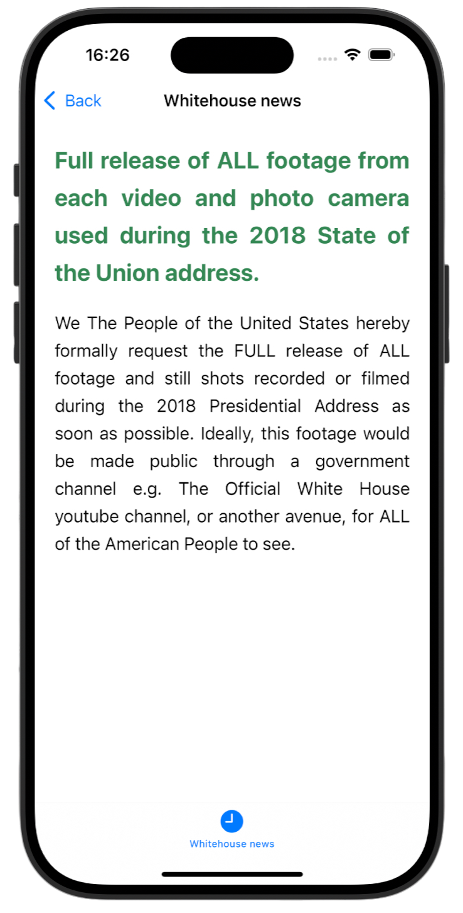

# Whitehouse Petitions 🏛️

[Project 7](https://www.hackingwithswift.com/read/7/overview) from the [100 Days of Swift course](https://www.hackingwithswift.com/100) by [Hacking With Swift](https://www.hackingwithswift.com/).

>An iOS app that fetches and displays petitions from the Whitehouse API, with options to view details and filter them by keywords

## Contents

|                      Day                      | Contents                                                                                                                                                                                                                                                                         |
|:---------------------------------------------:|:---------------------------------------------------------------------------------------------------------------------------------------------------------------------------------------------------------------------------------------------------------------------------------|
| [33](https://www.hackingwithswift.com/100/33) | <ul><li>[Setting up](https://www.hackingwithswift.com/read/7/1/setting-up)</li><li>[Creating the basic UI: UITabBarController](https://www.hackingwithswift.com/read/7/2)</li><li>[Parsing JSON using the Codable protocol](https://www.hackingwithswift.com/read/7/3)</li></ul> |
| [34](https://www.hackingwithswift.com/100/34) | <ul><li>[Rendering a petition: loadHTMLString](https://www.hackingwithswift.com/read/7/4)</li><li>[Finishing touches: didFinishLaunchingWithOptions](https://www.hackingwithswift.com/read/7/5)</li></ul>                                                                        | 
| [35](https://www.hackingwithswift.com/100/35) | <ul><li>[Wrap up](https://www.hackingwithswift.com/read/7/6/wrap-up)</li><li>[Review for Project 7: Whitehouse Petitions](https://www.hackingwithswift.com/review/hws/project-7-whitehouse-petitions)</li></ul>                                                                  |


## Challenges

Taken from [here](https://www.hackingwithswift.com/read/7/6/wrap-up):

>1. Add a Credits button to the top-right corner using `UIBarButtonItem`. When this is tapped, show an alert telling users the data comes from the We The People API of the Whitehouse.
>2. Let users filter the petitions they see. This involves creating a second array of filtered items that contains only petitions matching a string the user entered. Use a `UIAlertController` with a text field to let them enter that string. This is a tough one, so I’ve included some hints below if you get stuck.
>3. Experiment with the HTML – this isn’t a HTML or CSS tutorial, but you can find lots of resources online to give you enough knowledge to tinker with the layout a little.

## Screenshots

<div align="center">
  
  
  
  
</div>

---

## Installation

1. Clone this repository:  
   ```bash
   git clone https://github.com/gurman-man/100-days-of-swift.git
   ```
2. Open `Project7.xcodeproj` in Xcode
3. Run on the simulator or your device
