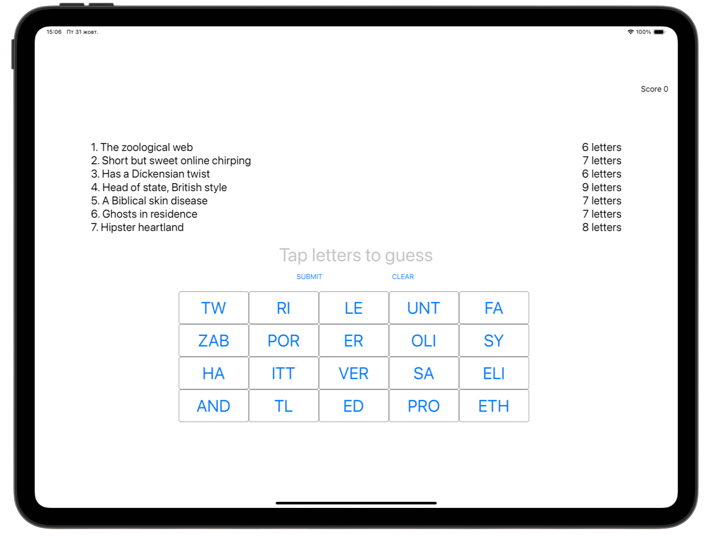

# LetterQuest ❔

[Project 8](https://www.hackingwithswift.com/read/8/overview) from the [100 Days of Swift course](https://www.hackingwithswift.com/100) by [Hacking With Swift](https://www.hackingwithswift.com/).

>An interactive iOS word game where players guess answers from clues by tapping letter fragments, track their score, and progress through increasingly challenging levels.

## Contents

|                      Day                      | Contents                                                                                                                                                                                                                                                                                   |
|:---------------------------------------------:|:-------------------------------------------------------------------------------------------------------------------------------------------------------------------------------------------------------------------------------------------------------------------------------------------|
| [36](https://www.hackingwithswift.com/100/36) | <ul><li>[Setting up](https://www.hackingwithswift.com/read/8/1/setting-up)</li><li>[Building a UIKit user interface programmatically](https://www.hackingwithswift.com/read/8/2)</li></ul>                                                                                                 |
| [37](https://www.hackingwithswift.com/100/37) | <ul><li>[Loading a level and adding button targets](https://www.hackingwithswift.com/read/8/3)</li><li>[It's play time: firstIndex(of:) and joined()](https://www.hackingwithswift.com/read/8/4)</li><li>[Property observers: didSet](https://www.hackingwithswift.com/read/8/5)</li></ul> | 
| [38](https://www.hackingwithswift.com/100/38) | <ul><li>[Wrap up](https://www.hackingwithswift.com/read/8/6/wrap-up)</li><li>[Review for Project 8: 7 Swifty Words](https://www.hackingwithswift.com/review/hws/project-8-7-swifty-words)</li></ul>                                                                                        |


## Challenges

Taken from [here](https://www.hackingwithswift.com/read/8/6/wrap-up):

>1. Use the techniques you learned in project 2 to draw a thin gray line around the buttons view, to make it stand out from the rest of the UI.
>2. If the user enters an incorrect guess, show an alert telling them they are wrong. You’ll need to extend the `submitTapped()` method so that if `firstIndex(of:)` failed to find the guess you show the alert.
>3. Try making the game also deduct points if the player makes an incorrect guess. Think about how you can move to the next level – we can’t use a simple division remainder on the player’s `score` any more, because they might have lost some points.

## To Do as a Personal Challenge...

- [ ] Add more levels

## Screenshots

<div align="center">
  
  
</div>

---

## Installation

1. Clone this repository:  
   ```bash
   git clone https://github.com/gurman-man/100-days-of-swift.git
   ```
2. Open `Project8.xcodeproj` in Xcode
3. Run on the simulator or your device
