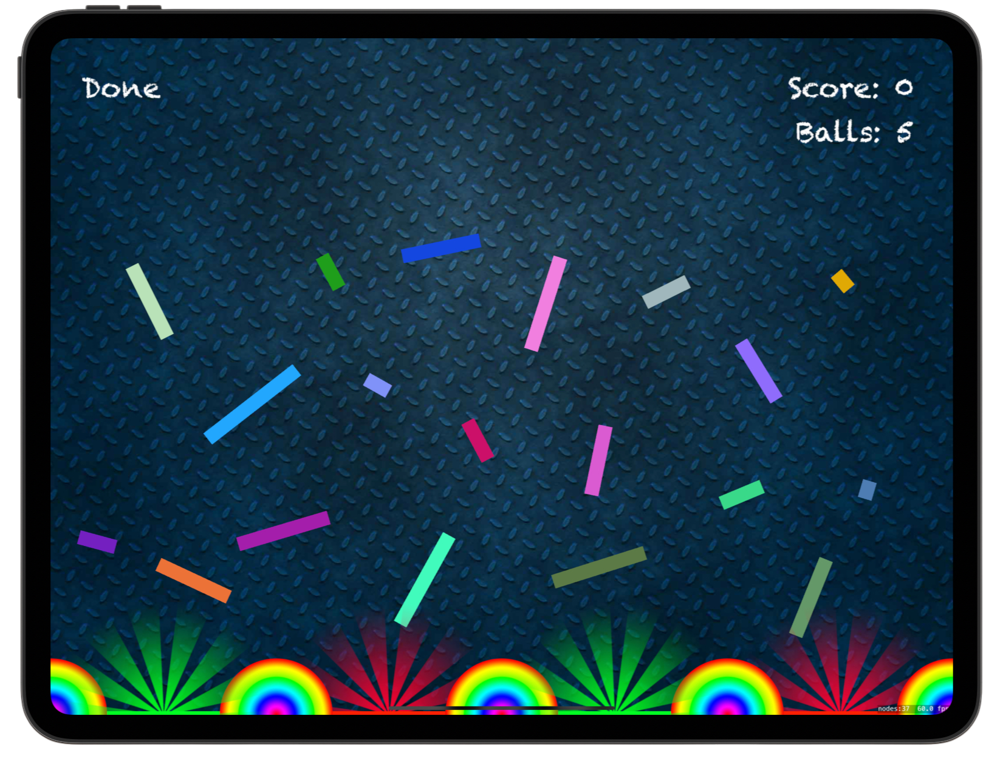

# 🎯 Pachinko 🎯

[Project 11](https://www.hackingwithswift.com/read/11/overview) from the [100 Days of Swift course](https://www.hackingwithswift.com/100) by [Hacking With Swift](https://www.hackingwithswift.com/).

>An iOS physics-based game where players drop colorful balls into slots to earn points — featuring realistic collisions, animated effects, and an edit mode to design custom obstacles.

## Contents

|                      Day                      | Contents                                                                                                                                                                                                                                                                             |
|:---------------------------------------------:|:-------------------------------------------------------------------------------------------------------------------------------------------------------------------------------------------------------------------------------------------------------------------------------------|
| [45](https://www.hackingwithswift.com/100/45) | <ul><li>[Setting up](https://www.hackingwithswift.com/read/11/1/setting-up)</li><li>[Falling boxes: SKSpriteNode, UITouch, SKPhysicsBody](https://www.hackingwithswift.com/read/11/2)</li><li>[Bouncing balls: circleOfRadius](https://www.hackingwithswift.com/read/11/3)</li></ul> |
| [46](https://www.hackingwithswift.com/100/46) | <ul><li>[Spinning slots: SKAction](https://www.hackingwithswift.com/read/11/4)</li><li>[Collision detection: SKPhysicsContactDelegate](https://www.hackingwithswift.com/read/11/5)</li><li>[Scores on the board: SKLabelNode](https://www.hackingwithswift.com/read/11/6)</li></ul>  | 
| [47](https://www.hackingwithswift.com/100/47) | <ul><li>[Special effects: SKEmitterNode](https://www.hackingwithswift.com/read/11/7)</li><li>[Wrap up](https://www.hackingwithswift.com/read/11/8/wrap-up)</li><li>[Review for Project 11: Pachinko](https://www.hackingwithswift.com/review/hws/project-11-pachinko)</li></ul>      |


## Challenges

Taken from [here](https://www.hackingwithswift.com/read/11/8/wrap-up):

>1. The pictures we’re using in have other ball pictures rather than just “ballRed”. Try writing code to use a random ball color each time they tap the screen.
>2. Right now, users can tap anywhere to have a ball created there, which makes the game too easy. Try to force the Y value of new balls so they are near the top of the screen.
>3. Give players a limit of five balls, then remove obstacle boxes when they are hit. Can they clear all the pins with just five balls? You could make it so that landing on a green slot gets them an extra ball.

## Screenshots

<div align="center">
  
  
</div>

---

## Installation

1. Clone this repository:  
   ```bash
   git clone https://github.com/gurman-man/100-days-of-swift.git
   ```
2. Open `Project11.xcodeproj` in Xcode
3. Run on the simulator or your device
