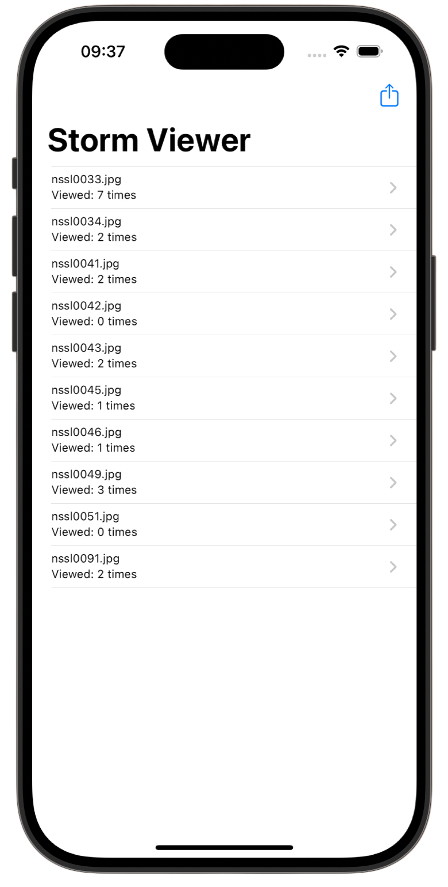
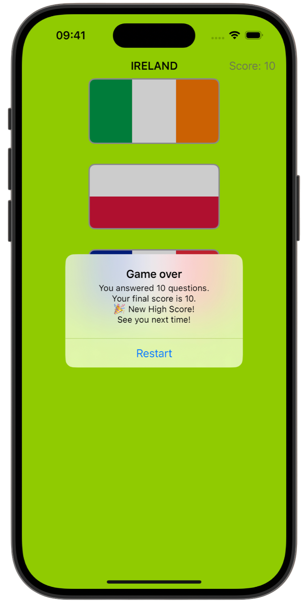
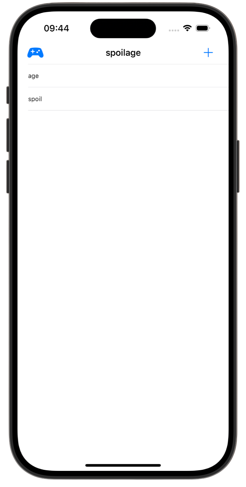

# UserDefaults 💾

[Project 12](https://www.hackingwithswift.com/read/12/overview) from the [100 Days of Swift course](https://www.hackingwithswift.com/100) by [Hacking With Swift](https://www.hackingwithswift.com/).

>A practice on using UserDefaults to store and retrieve small pieces of data, such as user settings or app state, demonstrating basic persistent storage in iOS.

## Contents

|                      Day                      | Contents                                                                                                                                                                                                                                                                    |
|:---------------------------------------------:|:----------------------------------------------------------------------------------------------------------------------------------------------------------------------------------------------------------------------------------------------------------------------------|
| [48](https://www.hackingwithswift.com/100/48) | <ul><li>[Setting up](https://www.hackingwithswift.com/read/12/1/setting-up)</li><li>[Reading and writing basics: UserDefaults](https://www.hackingwithswift.com/read/12/2)</li><li>[Fixing Project 10: NSCoding](https://www.hackingwithswift.com/read/12/3)</li></ul>      |
| [49](https://www.hackingwithswift.com/100/49) | <ul><li>[Fixing Project 10: Codable](https://www.hackingwithswift.com/read/12/4)</li><li>[Wrap up](https://www.hackingwithswift.com/read/12/5)</li><li>[Review for Project 12: UserDefaults](https://www.hackingwithswift.com/review/hws/project-12-userdefaults)</li></ul> | 


## Challenges

Taken from [here](https://www.hackingwithswift.com/read/11/8/wrap-up):

>1. Modify project 1 so that it remembers how many times each storm image was shown – you don’t need to show it anywhere, but you’re welcome to try modifying your original copy of project 1 to show the view count as a subtitle below each image name in the table view.
>2. Modify project 2 so that it saves the player’s highest score, and shows a special message if their new score beat the previous high score.
>3. Modify project 5 so that it saves the current word and all the player’s entries to UserDefaults, then loads them back when the app launches.

## Screenshots

<div align="center">
  
  
   
</div>

---

## Installation

1. Clone this repository:  
   ```bash
   git clone https://github.com/gurman-man/100-days-of-swift.git
   ```
2. Open `Project1/2/5.xcodeproj` in Xcode
3. Run on the simulator or your device
