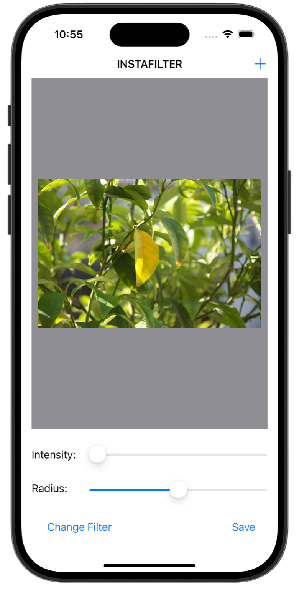
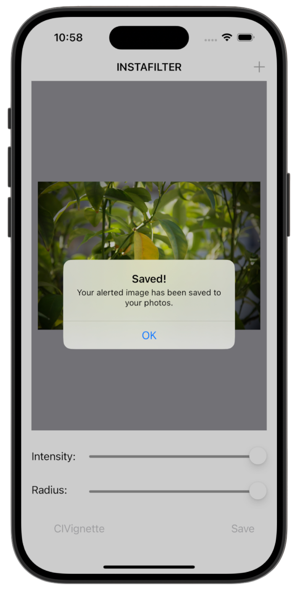
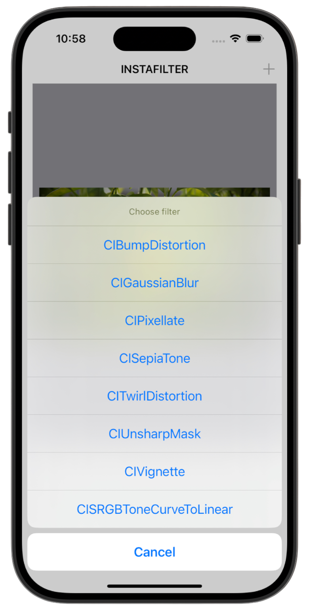

# InstaFilter 🎨

[Project 13](https://www.hackingwithswift.com/read/13/overview) from the [100 Days of Swift course](https://www.hackingwithswift.com/100) by [Hacking With Swift](https://www.hackingwithswift.com/).

>An iOS photo editing app that lets users import images, apply Core Image filters with adjustable intensity and radius, preview results in real time, and save the final image to their photo library.

## Contents

|                      Day                      | Contents                                                                                                                                                                                                                                      |
|:---------------------------------------------:|:----------------------------------------------------------------------------------------------------------------------------------------------------------------------------------------------------------------------------------------------|
| [52](https://www.hackingwithswift.com/100/52) | <ul><li>[Setting up](https://www.hackingwithswift.com/read/13/1/setting-up)</li><li>[Designing the interface](https://www.hackingwithswift.com/read/13/2)</li><li>[Importing a picture](https://www.hackingwithswift.com/read/13/3)</li></ul> |
| [53](https://www.hackingwithswift.com/100/53) | <ul><li>[Applying filters: CIContext, CIFilter](https://www.hackingwithswift.com/read/13/4)</li><li>[Saving to the iOS photo library](https://www.hackingwithswift.com/read/13/5)</li></ul>                                                   | 
| [54](https://www.hackingwithswift.com/100/54) | <ul><li>[Wrap up](https://www.hackingwithswift.com/read/13/5)</li><li>[Review for Project 13: Instafilter](https://www.hackingwithswift.com/review/hws/project-13-instafilter)</li></ul>                                                      |


## Challenges

Taken from [here](https://www.hackingwithswift.com/read/13/5):

>1. Try making the Save button show an error if there was no image in the image view.
>2. Make the Change Filter button change its title to show the name of the currently selected filter.
>3. Experiment with having more than one slider, to control each of the input keys you care about. For example, you might have one for radius and one for intensity.

## To Do as a Personal Challenge...

- [ ] To add more filters

## Screenshots

<div align="center">
  
  
  
</div>

---

## Installation

1. Clone this repository:  
   ```bash
   git clone https://github.com/gurman-man/100-days-of-swift.git
   ```
2. Open `Project13.xcodeproj` in Xcode
3. Run on the simulator or your device
