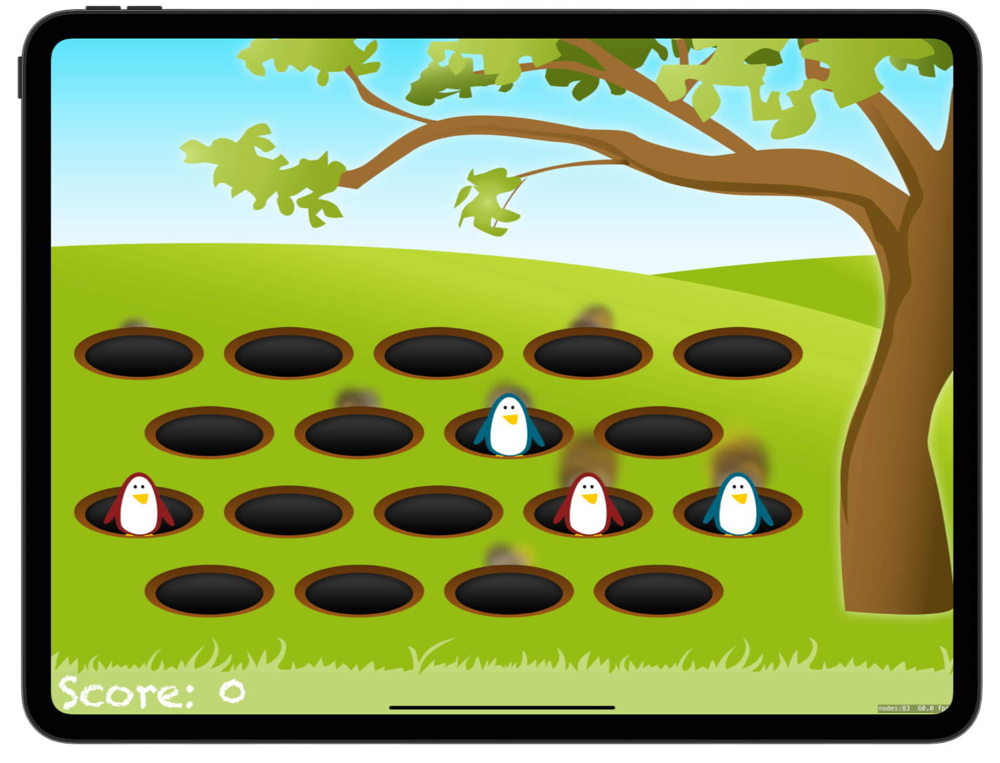
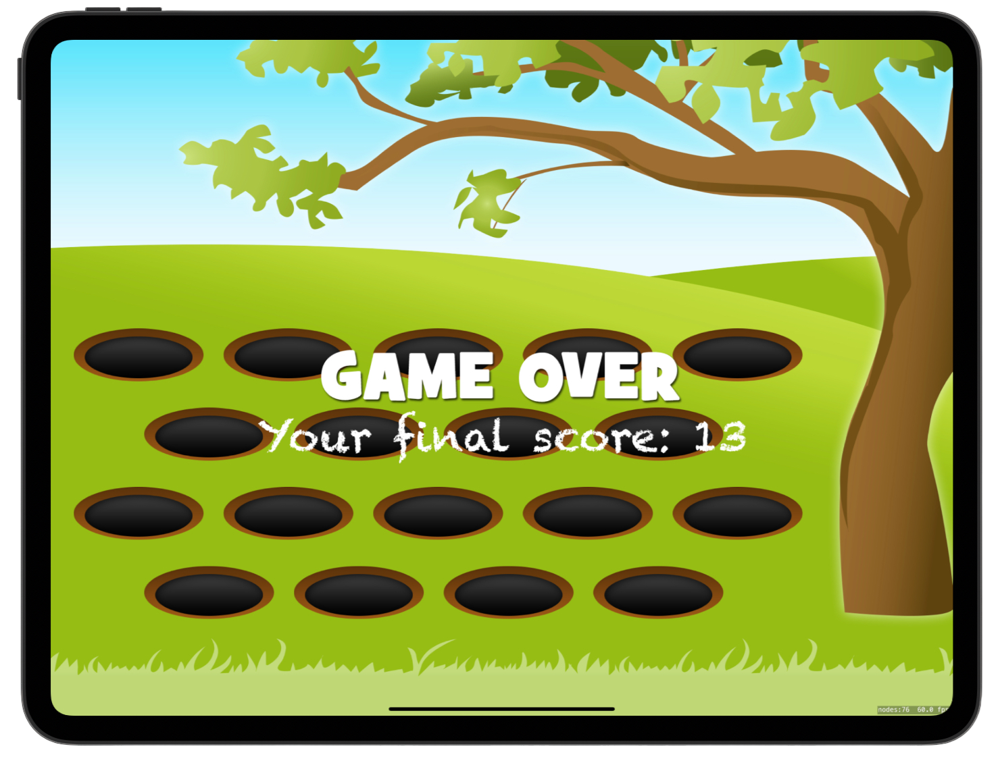

# Whack-a-Penguin 🐧

>An iOS arcade game built with SpriteKit where players tap evil penguins to score points while avoiding friendly ones — featuring particle effects, animations, sound effects, and an increasing difficulty with each round.


[Project 14](https://www.hackingwithswift.com/read/14/overview) from the [100 Days of Swift course](https://www.hackingwithswift.com/100) by [Hacking With Swift](https://www.hackingwithswift.com/).

## Contents

|                      Day                      | Contents                                                                                                                                                                                                                                                                                   |
|:---------------------------------------------:|:-------------------------------------------------------------------------------------------------------------------------------------------------------------------------------------------------------------------------------------------------------------------------------------------|
| [55](https://www.hackingwithswift.com/100/55) | <ul><li>[Setting up](https://www.hackingwithswift.com/read/14/1/setting-up)</li><li>[Getting up and running: SKCropNode](https://www.hackingwithswift.com/read/14/2)</li><li>[Penguin, show thyself: SKAction moveBy(x:y:duration:)](https://www.hackingwithswift.com/read/14/3)</li></ul> |
| [56](https://www.hackingwithswift.com/100/56) | <ul><li>[Whack to win: SKAction sequences](https://www.hackingwithswift.com/read/14/4)</li><li>[Wrap up](https://www.hackingwithswift.com/read/14/5)</li><li>[Review for Project 14: Whack-a-Penguin](https://www.hackingwithswift.com/read/14/6)</li></ul>                                | 


## Challenges

Taken from [here](https://www.hackingwithswift.com/read/14/5):

>1. Record your own voice saying "Game over!" and have it play when the game ends.
>2. When showing “Game Over” add an `SKLabelNode` showing their final score.
>3. Use `SKEmitterNode` to create a smoke-like effect when penguins are hit, and a separate mud-like effect when they go into or come out of a hole.

## Screenshots

<div align="center">
  
  
</div>

---

## Installation

1. Clone this repository:  
   ```bash
   git clone https://github.com/gurman-man/100-days-of-swift.git
   ```
2. Open `Project14.xcodeproj` in Xcode
3. Run on the simulator or your device
