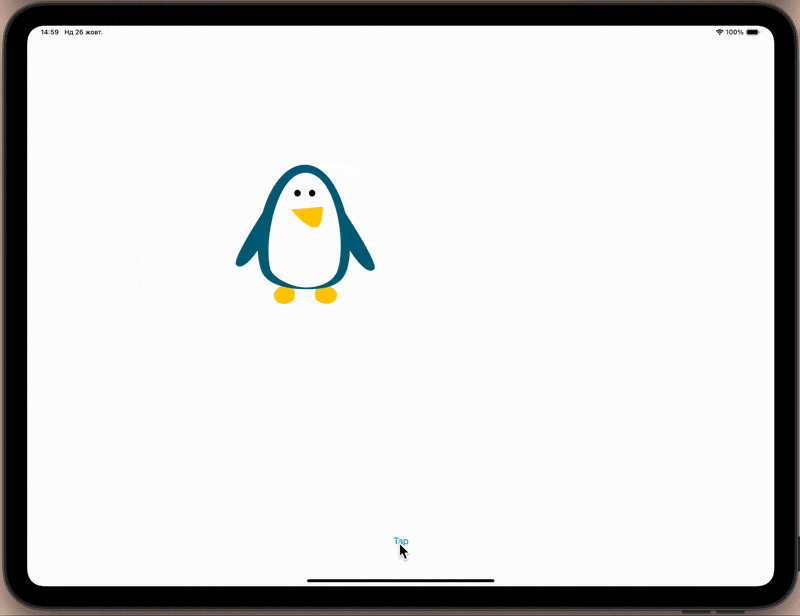

# Animation 🎲

[Project 15](https://www.hackingwithswift.com/read/15/overview) from the [100 Days of Swift course](https://www.hackingwithswift.com/100) by [Hacking With Swift](https://www.hackingwithswift.com/).

>An iOS app that demonstrates UIKit animations by applying transformations, rotations, scaling, and fading effects to an image — showcasing how to use `UIView.animate()` and spring damping for smooth, interactive motion.

## Contents

|                      Day                      | Contents                                                                                                                                                                                                                                                                                                                                                |
|:---------------------------------------------:|:--------------------------------------------------------------------------------------------------------------------------------------------------------------------------------------------------------------------------------------------------------------------------------------------------------------------------------------------------------|
| [57](https://www.hackingwithswift.com/100/57) | <ul><li>[Setting up](https://www.hackingwithswift.com/read/15/1/setting-up)</li><li>[Preparing for action](https://www.hackingwithswift.com/read/15/2)</li><li>[Switch, case, animate: animate(withDuration:)](https://www.hackingwithswift.com/read/15/3)</li><li>[Transform: CGAffineTransform](https://www.hackingwithswift.com/read/15/4)</li></ul> |
| [58](https://www.hackingwithswift.com/100/58) | <ul><li>[Wrap up](https://www.hackingwithswift.com/read/15/5)</li><li>[Review for Project 15: Animation](https://www.hackingwithswift.com/review/hws/project-15-animation)</li></ul>                                                                                                                                                                    | 


## Challenges

Taken from [here](https://www.hackingwithswift.com/read/15/5):

>1. Go back to [project 8](https://github.com/gurman-man/100-days-of-swift/tree/main/Projects/08-LetterQuest) and make the letter group buttons fade out when they are tapped. We were using the `isHidden` property, but you'll need to switch to `alpha` because `isHidden` is either true or false, it has no animatable values between.
>2  Go back to [project 13](https://github.com/gurman-man/100-days-of-swift/tree/main/Projects/13-InstaFilter) and make the image view fade in when a new picture is chosen. To make this work, set the `alpha` to 0 first.
>3. Go back to [project 2](https://github.com/gurman-man/100-days-of-swift/tree/main/Projects/02-GuessTheFlag) and make the flags scale down with a little bounce when pressed.

## Screenshots

<div align="center">
  
</div>

---

## Installation

1. Clone this repository:  
   ```bash
   git clone https://github.com/gurman-man/100-days-of-swift.git
   ```
2. Open `Project15.xcodeproj` in Xcode
3. Run on the simulator or your device
