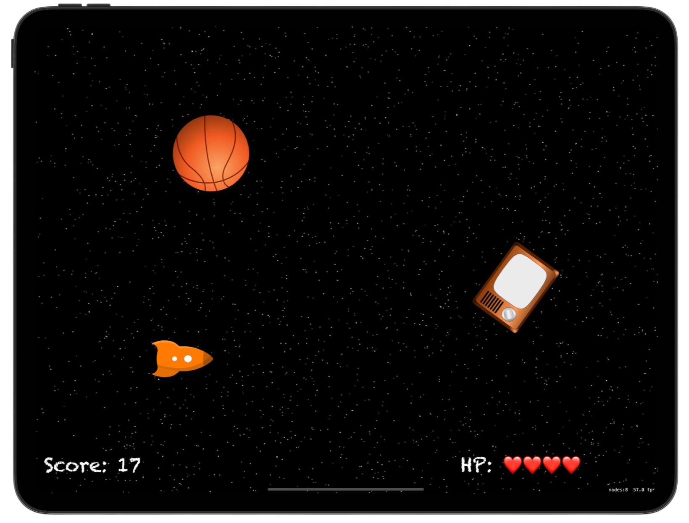
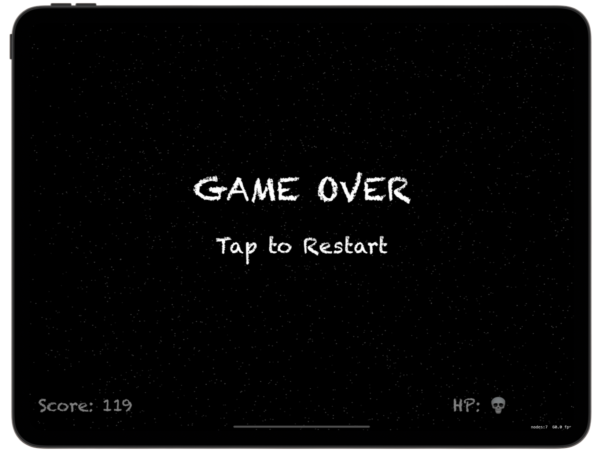

# 🚀 SpaceDodger 🚀 

[Project 17](https://www.hackingwithswift.com/read/17/overview) from the [100 Days of Swift course](https://www.hackingwithswift.com/100) by [Hacking With Swift](https://www.hackingwithswift.com/).

>An iOS arcade game built with SpriteKit where players pilot a spaceship through a stream of falling obstacles, collecting points, avoiding collisions, and surviving as long as possible — featuring particle effects, physics interactions, and dynamic difficulty scaling.

## Contents

|                      Day                      | Contents                                                                                                                                                                                                                                                                                                                                                         |
|:---------------------------------------------:|:-----------------------------------------------------------------------------------------------------------------------------------------------------------------------------------------------------------------------------------------------------------------------------------------------------------------------------------------------------------------|
| [62](https://www.hackingwithswift.com/100/62) | <ul><li>[Setting up](https://www.hackingwithswift.com/read/17/1/setting-up)</li><li>[Space: the final frontier](https://www.hackingwithswift.com/read/17/2)</li><li>[Bring on the enemies: linearDamping, angularDamping](https://www.hackingwithswift.com/read/17/3)</li><li>[Making contact: didBegin()](https://www.hackingwithswift.com/read/17/4)</li></ul> |
| [63](https://www.hackingwithswift.com/100/63) | <ul><li>[Wrap up](https://www.hackingwithswift.com/read/17/5)</li><li>[Review for Project 17: Space Race](https://www.hackingwithswift.com/review/hws/project-17-space-race)</li></ul>                                                                                                                                                                           |


## Challenges

Taken from [here](https://www.hackingwithswift.com/read/17/5):

>1. Stop the player from cheating by lifting their finger and tapping elsewhere – try implementing touchesEnded() to make it work.
>2. Make the timer start at one second, but then after 20 enemies have been made subtract 0.1 seconds from it so it’s triggered every 0.9 seconds. After making 20 more, subtract another 0.1, and so on. Note: you should call invalidate() on gameTimer before giving it a new value, otherwise you end up with multiple timers.
>3. Stop creating space debris after the player has died.

## To Do as a Personal Challenge...

- Add Game Over sprite 
- Add lives
- Add **Try again** button when showing **Game Over**

## Screenshots

<div align="center">
  
  
</div>

---

## Installation

1. Clone this repository:  
   ```bash
   git clone https://github.com/gurman-man/100-days-of-swift.git
   ```
2. Open `Project17.xcodeproj` in Xcode
3. Run on the simulator or your device
