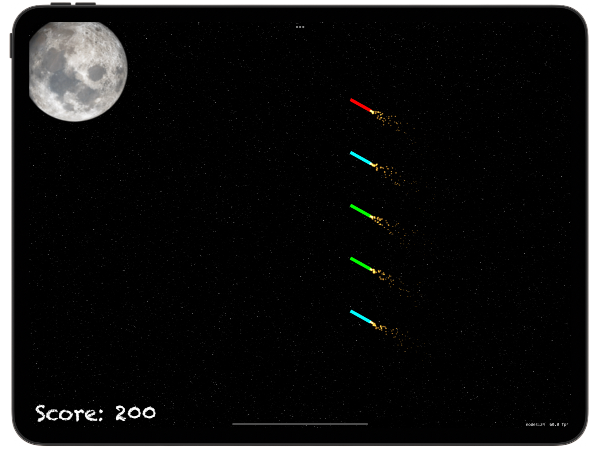
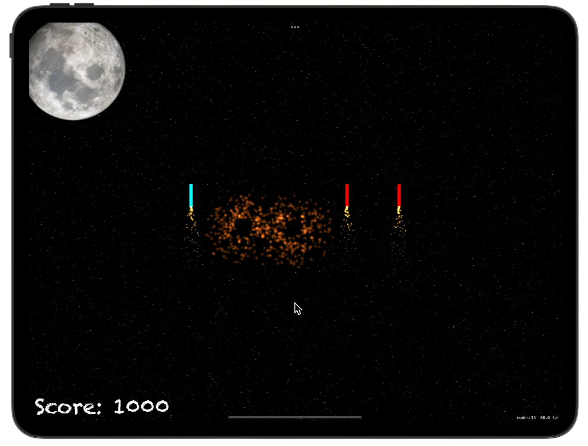

# 🎆 Fireworks Frenzy 🎆

[Project 20](https://www.hackingwithswift.com/read/20/overview) from the [100 Days of Swift course](https://www.hackingwithswift.com/100) by [Hacking With Swift](https://www.hackingwithswift.com/).

>An interactive SpriteKit game where players launch and detonate colorful fireworks, earning points for matching colors and timing explosions — practicing timers, touch handling, SpriteKit animations, and particle effects.

## Contents

|                      Day                      | Contents                                                                                                                                                                                                                                                                                    |
|:---------------------------------------------:|:--------------------------------------------------------------------------------------------------------------------------------------------------------------------------------------------------------------------------------------------------------------------------------------------|
| [70](https://www.hackingwithswift.com/100/70) | <ul><li>[Setting up](https://www.hackingwithswift.com/read/20/1/setting-up)</li><li>[Ready... aim... fire: Timer and follow()](https://www.hackingwithswift.com/read/20/2)</li><li>[Swipe to select](https://www.hackingwithswift.com/read/20/3)</li></ul>                                  |
| [71](https://www.hackingwithswift.com/100/71) | <ul><li>[Making things go bang: SKEmitterNode](https://www.hackingwithswift.com/read/20/4)</li><li>[Wrap up](https://www.hackingwithswift.com/read/20/5)</li><li>[Review for Project 20: Fireworks Night](https://www.hackingwithswift.com/review/hws/project-20-fireworks-night)</li></ul> |


## Challenges

Taken from [here](https://www.hackingwithswift.com/read/20/5):

>1. For an easy challenge try adding a score label that updates as the player's score changes
>2. Make the game end after a certain number of launches. You will need to use the `invalidate()` method of `Timer` to stop it from repeating.
>3. Use the `waitForDuration` and `removeFromParent` actions in a sequence to make sure explosion particle emitters are removed from the game scene when they are finished.

## Screenshots

<div align="center">
  
  
</div>

---

## Installation

1. Clone this repository:  
   ```bash
   git clone https://github.com/gurman-man/100-days-of-swift.git
   ```
2. Open `Project20.xcodeproj` in Xcode
3. Run on the simulator or your device
