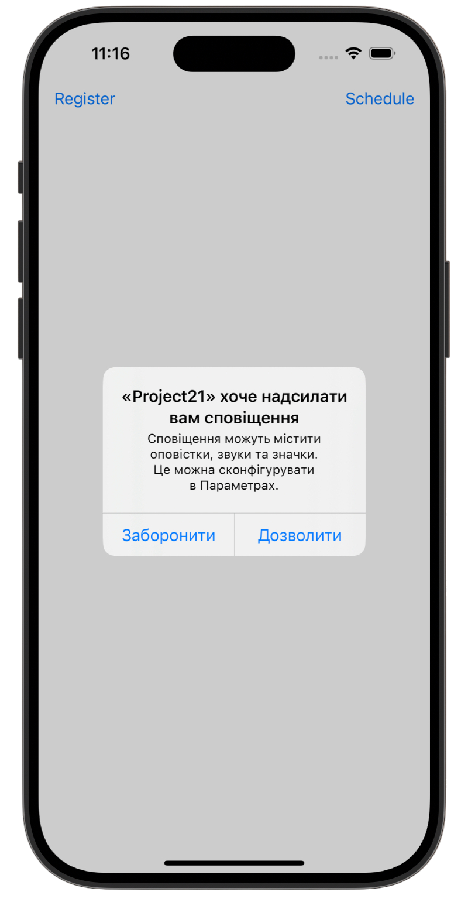
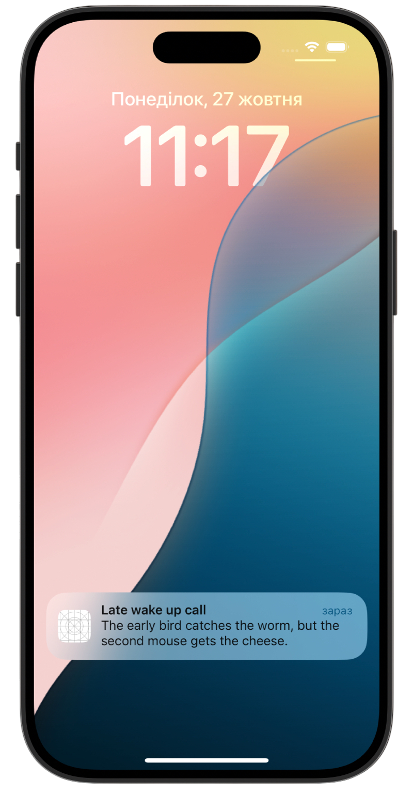
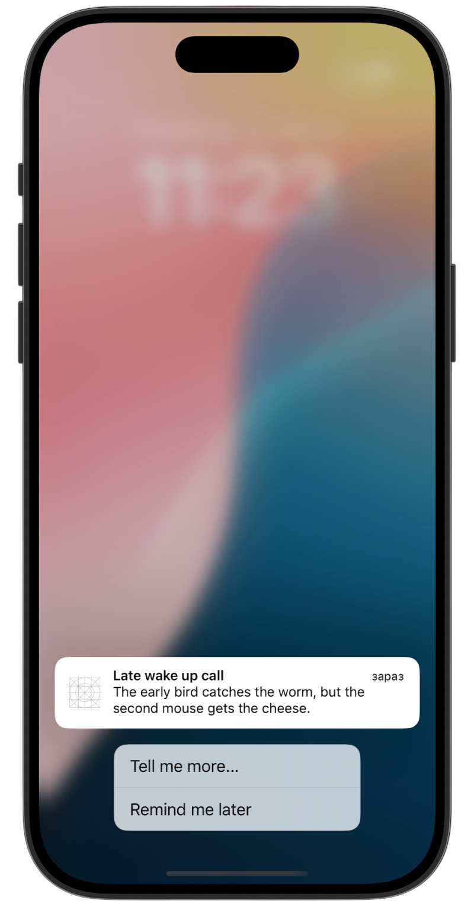

# 🔔 Local Notify 🔔

[Project 21](https://www.hackingwithswift.com/read/21/overview) from the [100 Days of Swift course](https://www.hackingwithswift.com/100) by [Hacking With Swift](https://www.hackingwithswift.com/).

>An iOS app that demonstrates how to register, schedule, and handle local notifications with custom actions using the UserNotifications framework.

## Contents

|                      Day                      | Contents                                                                                                                                                                                                                                                                                           |
|:---------------------------------------------:|:---------------------------------------------------------------------------------------------------------------------------------------------------------------------------------------------------------------------------------------------------------------------------------------------------|
| [72](https://www.hackingwithswift.com/100/72) | <ul><li>[Setting up](https://www.hackingwithswift.com/read/21/1/setting-up)</li><li>[Scheduling notifications: UNUserNotificationCenter and UNNotificationRequest](https://www.hackingwithswift.com/read/21/2)</li><li>[Acting on responses](https://www.hackingwithswift.com/read/21/3)</li></ul> |
| [73](https://www.hackingwithswift.com/100/73) | <ul><li>[Wrap up](https://www.hackingwithswift.com/read/21/4)</li><li>[Review for Project 21: Local Notifications](https://www.hackingwithswift.com/review/hws/project-21-local-notifications)</li></ul>                                                                                           |


## Challenges

Taken from [here](https://www.hackingwithswift.com/read/21/4):

>1. Update the code in `didReceive` so that it shows different instances of `UIAlertController` depending on which action identifier was passed in.
>2. For a harder challenge, add a second `UNNotificationAction` to the alarm category of project 21. Give it the title “Remind me later”, and make it call `scheduleLocal()` so that the same alert is shown in 24 hours. (For the purpose of these challenges, a time interval notification with 86400 seconds is good enough – that’s roughly how many seconds there are in a day, excluding summer time changes and leap seconds.)
>3. And for an even harder challenge, update [project 2](https://github.com/gurman-man/100-days-of-swift/tree/main/Projects/21-LocalNotify/02-GuessTheFlag(add-Local-Notification)) so that it reminds players to come back and play every day. This means scheduling a week of notifications ahead of time, each of which launch the app. When the app is finally launched, make sure you call `removeAllPendingNotificationRequests()` to clear any un-shown alerts, then make new alerts for future days.

## Screenshots

<div align="center">
  
  
  
</div>

---

## Installation

1. Clone this repository:  
   ```bash
   git clone https://github.com/gurman-man/100-days-of-swift.git
   ```
2. Open `Project21.xcodeproj` in Xcode
3. Run on the simulator or your device
