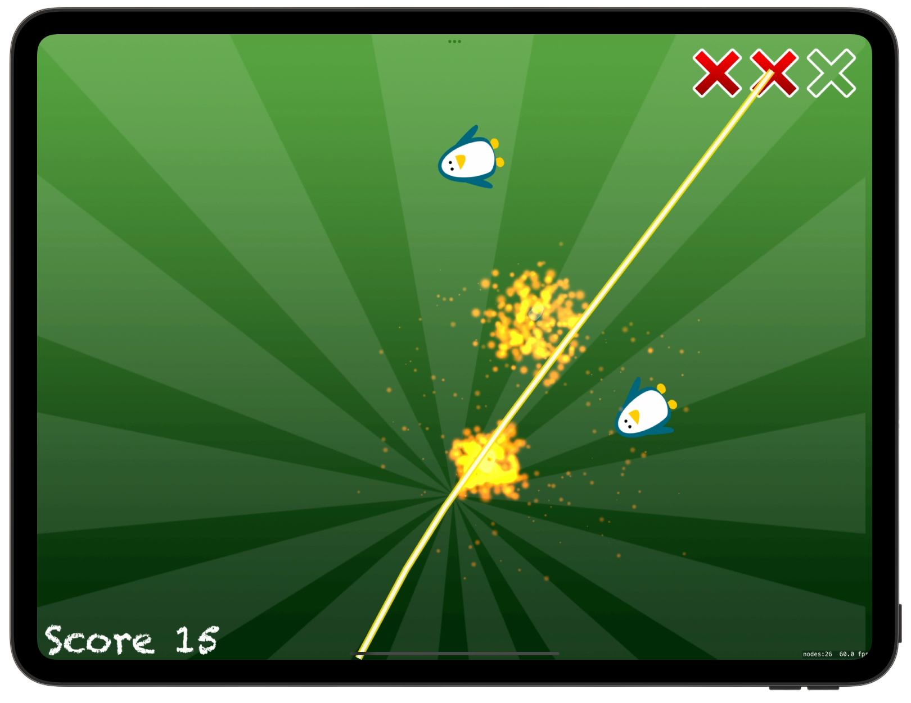

# 🥷 Swifty Ninja 🥷

[Project 23](https://www.hackingwithswift.com/read/23/overview) from the [100 Days of Swift course](https://www.hackingwithswift.com/100) by [Hacking With Swift](https://www.hackingwithswift.com/).

>An interactive iOS slicing game built with SpriteKit and AVFoundation, where players swipe to slice enemies while avoiding bombs. Features include dynamic enemy generation (regular, golden, and bomb enemies), score and life tracking, swipe trails with sound effects, and a full game loop with restart functionality.

## Contents

|                      Day                      | Contents                                                                                                                                                                                                                                                                                                                                                            |
|:---------------------------------------------:|:--------------------------------------------------------------------------------------------------------------------------------------------------------------------------------------------------------------------------------------------------------------------------------------------------------------------------------------------------------------------|
| [77](https://www.hackingwithswift.com/100/77) | <ul><li>[Setting up](https://www.hackingwithswift.com/read/23/1/setting-up)</li><li>[Basics quick start: SKShapeNode](https://www.hackingwithswift.com/read/23/2)</li><li>[Shaping up for action: CGPath and UIBezierPath](https://www.hackingwithswift.com/read/23/3)</li><li>[Enemy or bomb: AVAudioPlayer](https://www.hackingwithswift.com/read/23/4)</li></ul> |
| [78](https://www.hackingwithswift.com/100/78) | <ul><li>[Follow the sequence](https://www.hackingwithswift.com/read/23/5)</li><li>[Slice to win](https://www.hackingwithswift.com/read/23/6)</li><li>[Game over, man: SKTexture](https://www.hackingwithswift.com/read/23/7)</li></ul>                                                                                                                              |
| [79](https://www.hackingwithswift.com/100/79) | <ul><li>[Wrap up](https://www.hackingwithswift.com/read/23/8)</li><li>[Review for Project 23: Swifty Ninja](https://www.hackingwithswift.com/review/hws/project-23-swifty-ninja)</li></ul>                                                                                                                                                                          |


## Challenges

Taken from [here](https://www.hackingwithswift.com/read/23/8):

>1. Try removing the magic numbers in the createEnemy() method. Instead, define them as constant properties of your class, giving them useful names.
>2. Create a new, fast-moving type of enemy that awards the player bonus points if they hit it.
>3. Add a “Game over” sprite node to the game scene when the player loses all their lives.

## To Do as a Personal Challenge...

- To add **New Game** button

## Screenshots

<div align="center">
  
  
</div>

---

## Installation

1. Clone this repository:  
   ```bash
   git clone https://github.com/gurman-man/100-days-of-swift.git
   ```
2. Open `Project23.xcodeproj` in Xcode
3. Run on the simulator or your device
