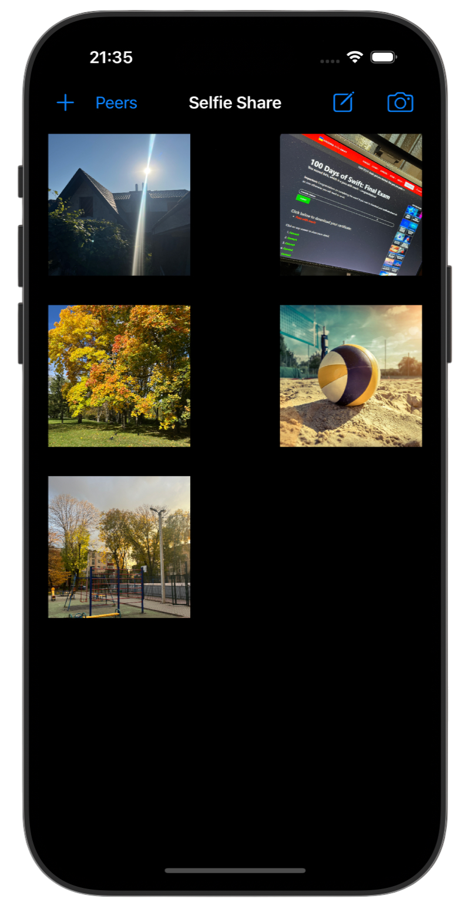
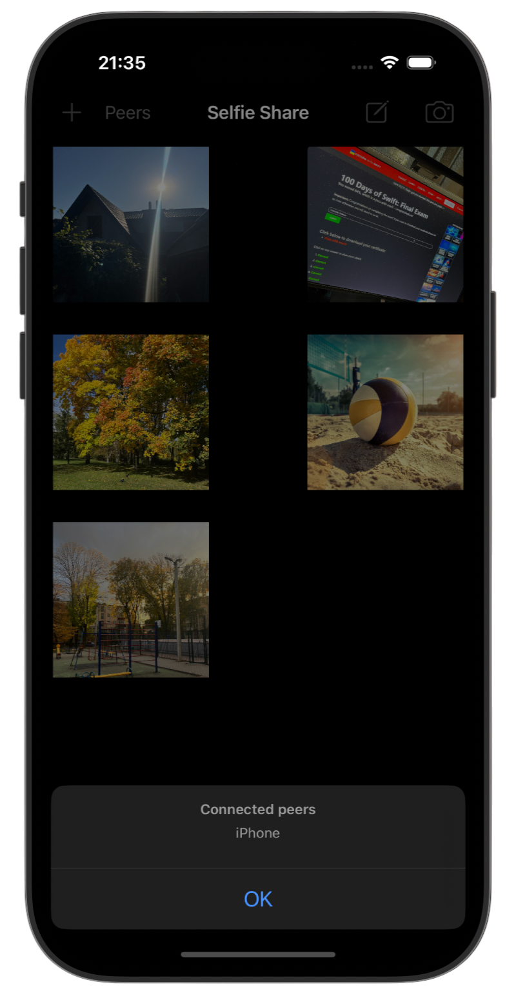
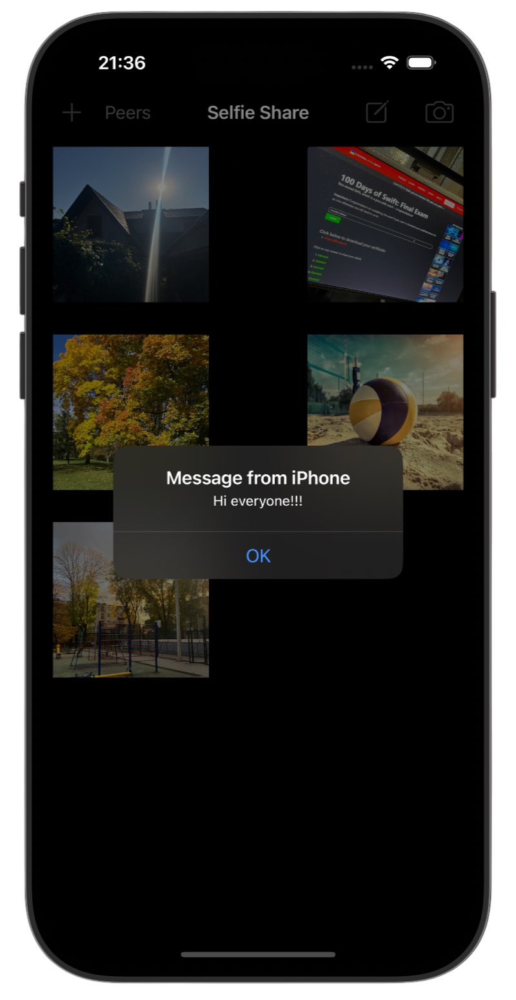
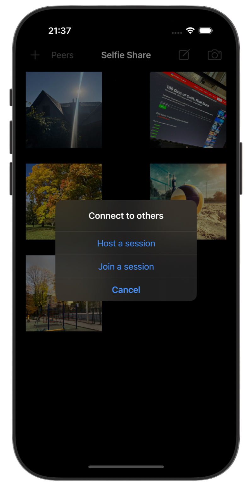

# 📤 Selfie Share 📤

[Project 25](https://www.hackingwithswift.com/read/25/overview) from the [100 Days of Swift course](https://www.hackingwithswift.com/100) by [Hacking With Swift](https://www.hackingwithswift.com/).

>A Swift app using MultipeerConnectivity to share photos and messages with nearby devices without internet.

## Contents

|                      Day                      | Contents                                                                                                                                                                                                                                                                                                                                                        |
|:---------------------------------------------:|:----------------------------------------------------------------------------------------------------------------------------------------------------------------------------------------------------------------------------------------------------------------------------------------------------------------------------------------------------------------|
| [83](https://www.hackingwithswift.com/100/83) | <ul><li>[Setting up](https://www.hackingwithswift.com/read/25/1/setting-up)</li><li>[Importing photos again](https://www.hackingwithswift.com/read/25/2)</li><li>[Going peer to peer: MCSession, MCBrowserViewController](https://www.hackingwithswift.com/read/25/3)</li><li>[Invitation only: MCPeerID](https://www.hackingwithswift.com/read/24/5)</li></ul> |
| [84](https://www.hackingwithswift.com/100/84) | <ul><li>[Wrap up](https://www.hackingwithswift.com/read/25/5)</li><li>[Review for Project 25: Selfie Share](https://www.hackingwithswift.com/review/hws/project-25-selfie-share)</li></ul>                                                                                                                                                                      |


## Challenges

Taken from [here](https://www.hackingwithswift.com/read/25/5):

>1. Show an alert when a user has disconnected from our multipeer network. Something like “Paul’s iPhone has disconnected” is enough.
>2. Try sending text messages across the network. You can create a `Data` from a string using `Data(yourString.utf8)`, and convert a `Data` back to a string by using `String(decoding: yourData, as: UTF8.self)`.
>3. Add a button that shows an alert controller listing the names of all devices currently connected to the session – use the `connectedPeers` property of your session to find that information.

## Screenshots

<div align="center">
  
  
  
  
</div>

---

## Installation

1. Clone this repository:  
   ```bash
   git clone https://github.com/gurman-man/100-days-of-swift.git
   ```
2. Open `Project25.xcodeproj` in Xcode
3. Run on the simulator or your device
