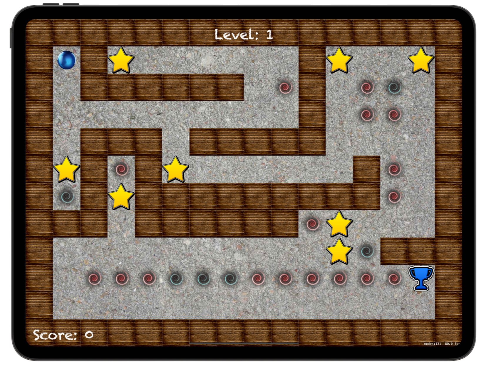
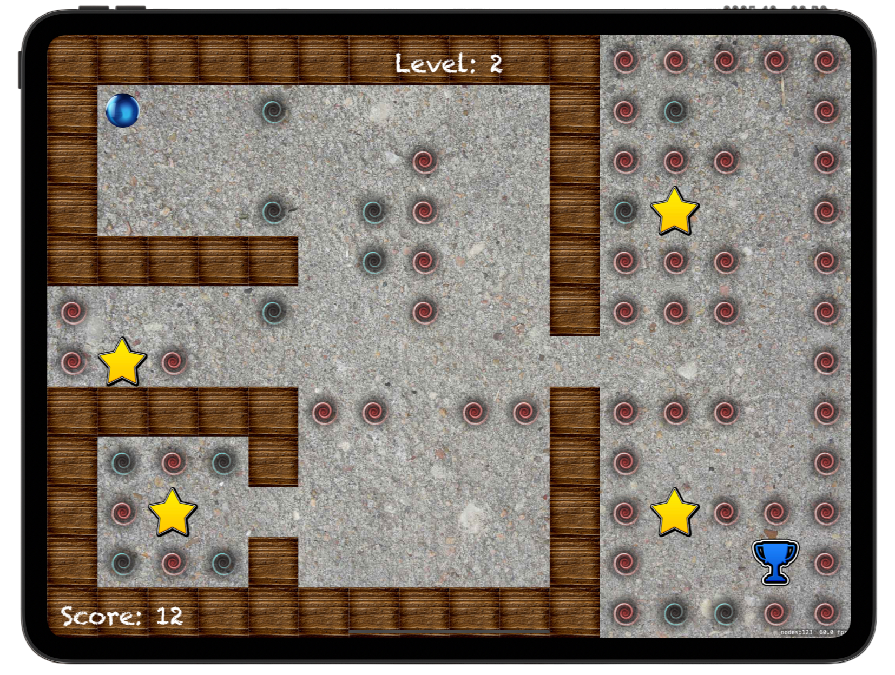

# 🌑 Marble Maze 🌑

[Project 26](https://www.hackingwithswift.com/read/26/overview) from the [100 Days of Swift course](https://www.hackingwithswift.com/100) by [Hacking With Swift](https://www.hackingwithswift.com/).

>Navigate your player through challenging mazes using tilt controls. Collect stars, avoid vortexes, and teleport across the map. Complete levels, earn points, and enjoy confetti celebrations when you reach the finish!

## Contents

|                      Day                      | Contents                                                                                                                                                                                                           |
|:---------------------------------------------:|:-------------------------------------------------------------------------------------------------------------------------------------------------------------------------------------------------------------------|
| [85](https://www.hackingwithswift.com/100/85) | <ul><li>[Setting up](https://www.hackingwithswift.com/read/26/1/setting-up)</li><li>[Loading a level: categoryBitMask, collisionBitMask, contactTestBitMask](https://www.hackingwithswift.com/read/26/2)</li></ul> |
| [86](https://www.hackingwithswift.com/100/86) | <ul><li>[Tilt to move: CMMotionManager](https://www.hackingwithswift.com/read/26/3)</li><li>[Contacting but not colliding](https://www.hackingwithswift.com/read/26/4)</li></ul>                                   |
| [87](https://www.hackingwithswift.com/100/87) | <ul><li>[Wrap up](https://www.hackingwithswift.com/read/26/5)</li><li>[Review for Project 26: Marble Maze](https://www.hackingwithswift.com/review/hws/project-26-marble-maze)</li></ul>                           |


## Challenges

Taken from [here](https://www.hackingwithswift.com/read/25/5):

>1. Rewrite the `loadLevel()` method so that it's made up of multiple smaller methods. This will make your code easier to read and easier to maintain, or at least it should do if you do a good job!
>2. When the player finally makes it to the finish marker, nothing happens. What should happen? Well, that's down to you now. You could easily design several new levels and have them progress through.
>3. Add a new block type, such as a teleport that moves the player from one teleport point to the other. Add a new letter type in `loadLevel()`, add another collision type to our enum, then see what you can do.

## To Do as a Personal Challenge...

- Add even more levels
- Save score & complete levels to `UserDefaults`

## Screenshots

<div align="center">
  
  
</div>

---

## Installation

1. Clone this repository:  
   ```bash
   git clone https://github.com/gurman-man/100-days-of-swift.git
   ```
2. Open `Project26.xcodeproj` in Xcode
3. Run on the simulator or your device
