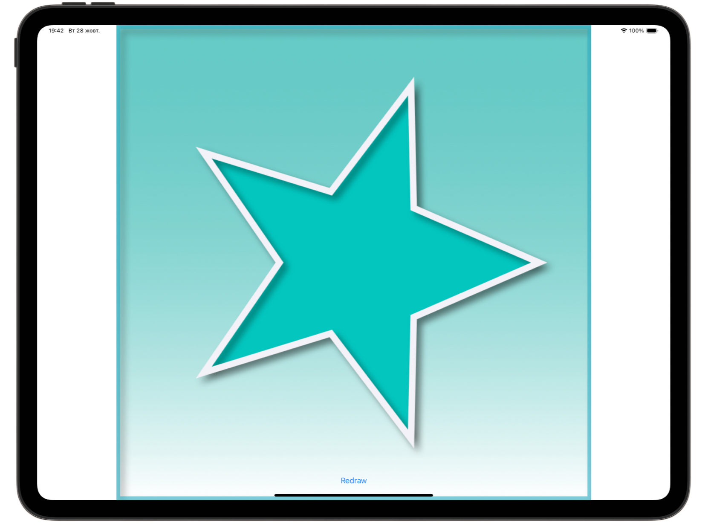
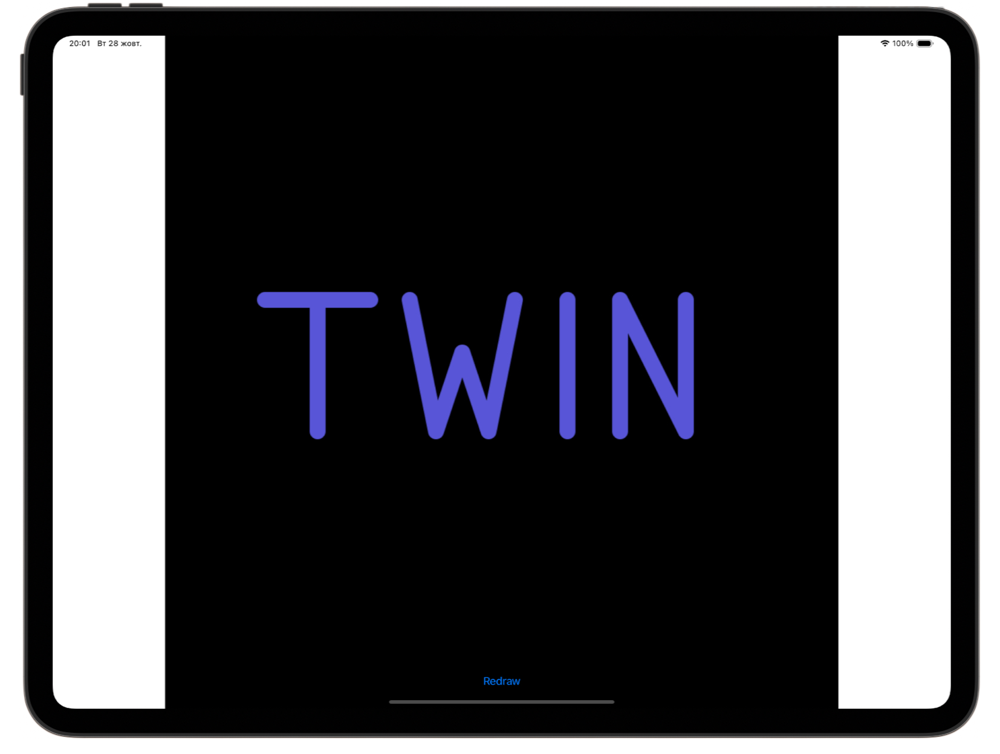

# 🎨 Core Graphics 🎨

[Project 27](https://www.hackingwithswift.com/read/27/overview) from the [100 Days of Swift course](https://www.hackingwithswift.com/100) by [Hacking With Swift](https://www.hackingwithswift.com/).

>An iOS app that demonstrates Core Graphics drawing — rectangles, circles, checkerboards, text, images, gradients, and custom shapes — using UIGraphicsImageRenderer and CGContext transformations.

## Contents

|                      Day                      | Contents                                                                                                                                                                                                                                                                                                                                                                                                                                                                                                                   |
|:---------------------------------------------:|:---------------------------------------------------------------------------------------------------------------------------------------------------------------------------------------------------------------------------------------------------------------------------------------------------------------------------------------------------------------------------------------------------------------------------------------------------------------------------------------------------------------------------|
| [88](https://www.hackingwithswift.com/100/88) | <ul><li>[Setting up](https://www.hackingwithswift.com/read/27/1/setting-up)</li><li>[Creating the sandbox](https://www.hackingwithswift.com/read/27/2)</li><li>[Drawing into a Core Graphics context with UIGraphicsImageRenderer](https://www.hackingwithswift.com/read/27/3)</li><li>[Ellipses and checkerboards](https://www.hackingwithswift.com/read/27/4)</li><li>[Transforms and lines](https://www.hackingwithswift.com/read/27/5)</li><li>[Images and text](https://www.hackingwithswift.com/read/27/6)</li></ul> |
| [89](https://www.hackingwithswift.com/100/89) | <ul><li>[Wrap up](https://www.hackingwithswift.com/read/27/7)</li><li>[Review for Project 27: Core Graphics](https://www.hackingwithswift.com/review/hws/project-27-core-graphics)</li></ul>                                                                                                                                                                                                                                                                                                                               |


## Challenges

Taken from [here](https://www.hackingwithswift.com/read/27/7):

>1. Pick any emoji and try creating it using Core Graphics. You should find some easy enough, but for a harder challenge you could also try something like the star emoji.
>2. Use a combination of `move(to:)` and `addLine(to:)` to create and stroke a path that spells **TWIN** on the canvas.
>3. Go back to [project 3](https://github.com/HenestrosaConH/100-days-of-swift/tree/main/Courses/03-SocialMedia) and change the way the selected image is shared so that it has some rendered text on top saying “From Storm Viewer”. This means reading the `size` property of the original image, creating a new canvas at that size, drawing the image in, then adding your text on top.

## Screenshots

<div align="center">
  
  
</div>

---

## Installation

1. Clone this repository:  
   ```bash
   git clone https://github.com/gurman-man/100-days-of-swift.git
   ```
2. Open `Project27.xcodeproj` in Xcode
3. Run on the simulator or your device
