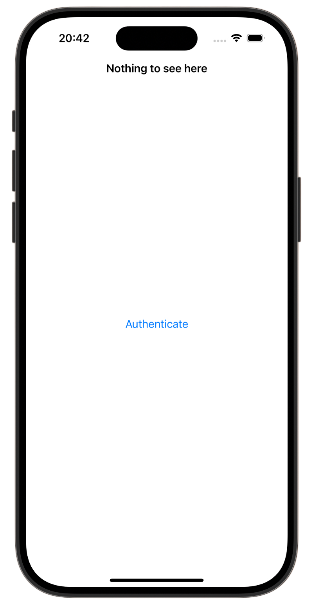
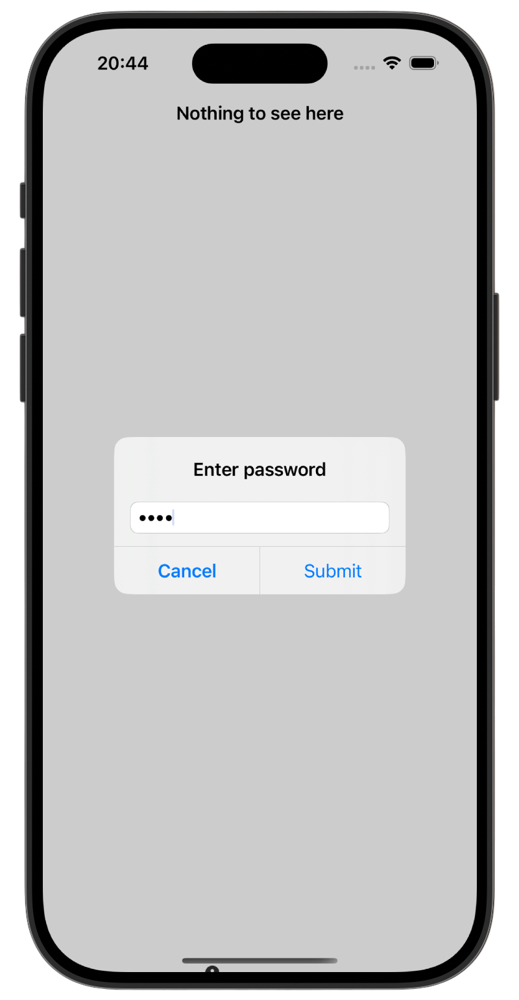
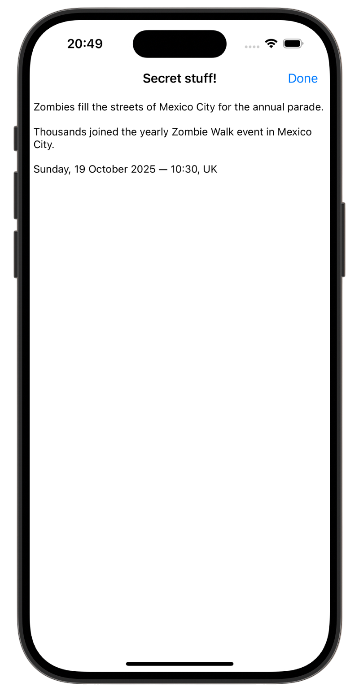

# 💻 Secret Swift 💻

[Project 28](https://www.hackingwithswift.com/read/28/overview) from the [100 Days of Swift course](https://www.hackingwithswift.com/100) by [Hacking With Swift](https://www.hackingwithswift.com/).

>An iOS app that locks your private notes using Face ID, Touch ID, or a custom password — securely stored in the Keychain.

## Contents

|                      Day                      | Contents                                                                                                                                                                                                                                                                                                                                                                            |
|:---------------------------------------------:|:------------------------------------------------------------------------------------------------------------------------------------------------------------------------------------------------------------------------------------------------------------------------------------------------------------------------------------------------------------------------------------|
| [92](https://www.hackingwithswift.com/100/92) | <ul><li>[Setting up](https://www.hackingwithswift.com/read/28/1/setting-up)</li><li>[The basic text editor](https://www.hackingwithswift.com/read/28/2)</li><li>[Writing somewhere safe: the iOS keychain](https://www.hackingwithswift.com/read/28/3)</li><li>[Touch to activate: Touch ID, Face ID and LocalAuthentication](https://www.hackingwithswift.com/read/28/4)</li></ul> |
| [93](https://www.hackingwithswift.com/100/93) | <ul><li>[Wrap up](https://www.hackingwithswift.com/read/28/5)</li><li>[Review for Project 28: Secret Swift](https://www.hackingwithswift.com/review/hws/project-28-secret-swift)</li></ul>                                                                                                                                                                                          |


## Challenges

Taken from [here](https://www.hackingwithswift.com/read/28/5):

>1. Add a Done button as a navigation bar item that causes the app to re-lock immediately rather than waiting for the user to quit. This should only be shown when the app is unlocked.
>2. Create a password system for your app so that the Touch ID/Face ID fallback is more useful. You'll need to use an alert controller with a text field like we did in project 5, and I suggest you save the password in the keychain!
>3. Go back to [project 10](https://github.com/gurman-man/100-days-of-swift/tree/main/Projects/28-SecretSwift/Project10(authentication)) and add biometric authentication so the user’s pictures are shown only when they have unlocked the app. You’ll need to give some thought to how you can hide the pictures – perhaps leave the array empty until they are authenticated?

## Screenshots

<div align="center">
  
  
  
</div>

---

## Installation

1. Clone this repository:  
   ```bash
   git clone https://github.com/gurman-man/100-days-of-swift.git
   ```
2. Open `Project28.xcodeproj` in Xcode
3. Run on the simulator or your device
