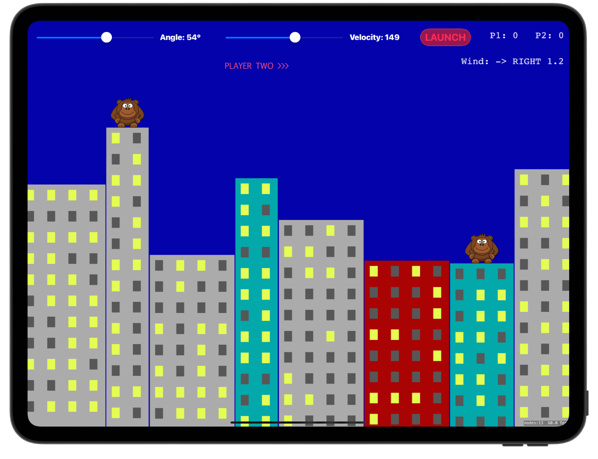
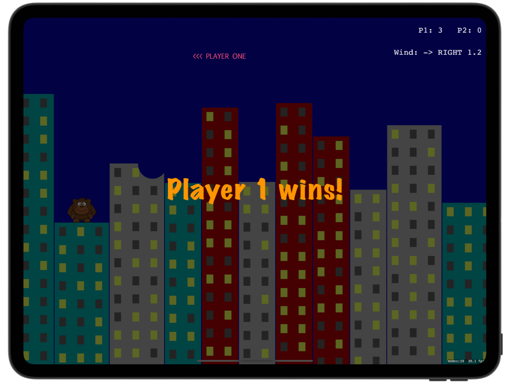

# 🦧 Exploding Monkeys 🦧

[Project 29](https://www.hackingwithswift.com/read/29/overview) from the [100 Days of Swift course](https://www.hackingwithswift.com/100) by [Hacking With Swift](https://www.hackingwithswift.com/).

>An iOS physics-based game where two players take turns throwing bananas across city rooftops, battling wind and gravity to hit each other.

## Contents

|                      Day                      | Contents                                                                                                                                                                                                                                                                                                 |
|:---------------------------------------------:|:---------------------------------------------------------------------------------------------------------------------------------------------------------------------------------------------------------------------------------------------------------------------------------------------------------|
| [94](https://www.hackingwithswift.com/100/94) | <ul><li>[Setting up](https://www.hackingwithswift.com/read/29/1/setting-up)</li><li>[Building the environment: SKTexture and filling a path](https://www.hackingwithswift.com/read/29/2)</li><li>[Mixing UIKit and SpriteKit: UISlider and SKView](https://www.hackingwithswift.com/read/29/3)</li></ul> |
| [95](https://www.hackingwithswift.com/100/95) | <ul><li>[Unleash the bananas: SpriteKit texture atlases](https://www.hackingwithswift.com/read/29/4)</li><li>[Destructible terrain: presentScene](https://www.hackingwithswift.com/read/29/5)</li></ul>                                                                                                  | 
| [96](https://www.hackingwithswift.com/100/96) | <ul><li>[Wrap up](https://www.hackingwithswift.com/read/29/6/wrap-up)</li><li>[Review for Project 29: Exploding Monkeys](https://www.hackingwithswift.com/review/hws/project-29-exploding-monkeys)</li></ul>                                                                                             |


## Challenges

Taken from [here](https://www.hackingwithswift.com/read/29/6/wrap-up):

>1. Add code and UI to track the player scores across levels, then make the game end after one player has won three times.
>2. Add Auto Layout rules for the UI components in our storyboard, allowing them to remain positioned neatly regardless of which iPad size is used.
>3. Use the physics world’s gravity to add random wind to each level, making sure to add a label telling players the direction and strength.

## Screenshots

<div align="center">
  
  
</div>

---

## Installation

1. Clone this repository:  
   ```bash
   git clone https://github.com/gurman-man/100-days-of-swift.git
   ```
2. Open `Project29.xcodeproj` in Xcode
3. Run on the simulator or your device
