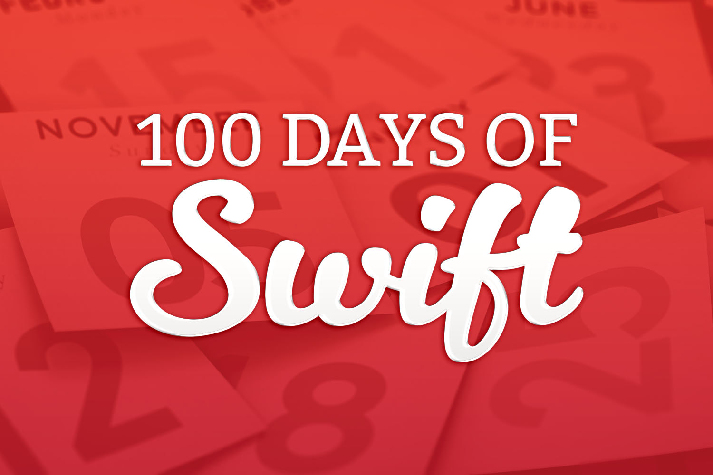
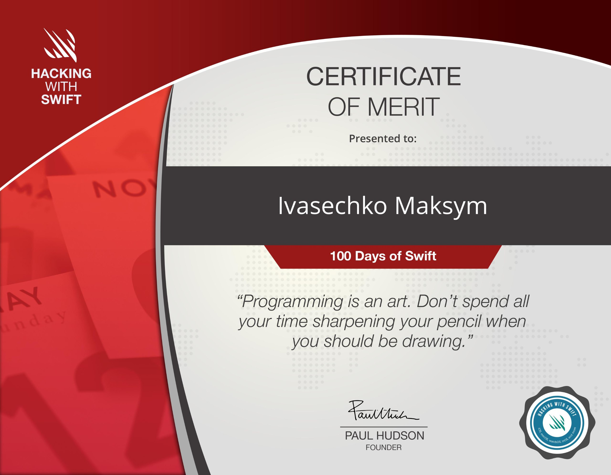
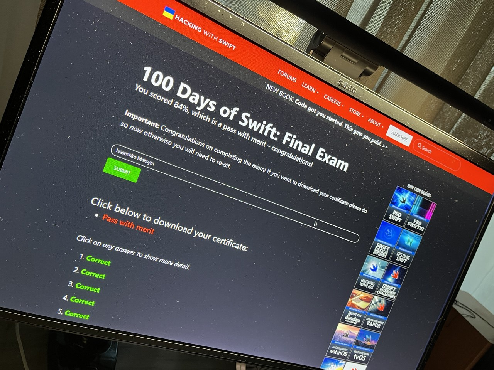

<h1 align="center">
  📚 <a href="https://www.hackingwithswift.com/100">100 Days of Swift</a> 🚀
</h1>

  My project collection from Paul Hudson’s course — 100 Days of Swift (Hacking with Swift)

  

---

### How to explore

- Click any project title to view the source code  
- Each project folder includes screenshots & a detailed README  

---

👇 **Lists of milestone-projects:** 👇

## 1. [Gallery Of Flags](https://github.com/gurman-man/100-days-of-swift/tree/main/MilestoneProjects/01-GalleryOfFlags) *(Day 23)*

## 2. [Shopping List](https://github.com/gurman-man/100-days-of-swift/tree/main/MilestoneProjects/02-ShoppingList) *(Day 32)*

## 3. [Hangman](https://github.com/gurman-man/100-days-of-swift/tree/main/MilestoneProjects/03-Hangman) *(Day 41)*

## 4. [Photo List](https://github.com/gurman-man/100-days-of-swift/tree/main/MilestoneProjects/04-PhotoList) *(Day 50)*

## 5. [Country Facts](https://github.com/gurman-man/100-days-of-swift/tree/main/MilestoneProjects/05-CountryFacts) *(Day 59)*

## 6. [Sprite Kit Game](https://github.com/gurman-man/100-days-of-swift/tree/main/MilestoneProjects/06-SpriteKitGame) *(Day 66)*

## 7. [Notes](https://github.com/gurman-man/100-days-of-swift/tree/main/MilestoneProjects/07-Notes) *(Day 74)*

## 8. [Swift Extensions](https://github.com/gurman-man/100-days-of-swift/tree/main/MilestoneProjects/08-SwiftExtensions) *(Day 82)*

## 9. [Meme Generator](https://github.com/gurman-man/100-days-of-swift/tree/main/MilestoneProjects/09-MemeGenerator) *(Day 90)*

## 10. [Memory-Pairs](https://github.com/gurman-man/100-days-of-swift/tree/main/MilestoneProjects/10-Memory-Pairs) *(Day 99)*

---

👇 **Lists of projects:** 👇

## 1. [Storm Viewer](https://github.com/gurman-man/100-days-of-swift/tree/main/Projects/01-StormViewer) *(Days 16 - 18)*

## 2. [Guess The Flag](https://github.com/gurman-man/100-days-of-swift/tree/main/Projects/02-GuessTheFlag) *(Days 19 - 21)*

## 3. [Social Media](https://github.com/gurman-man/100-days-of-swift/tree/main/Projects/03-SocialMedia) *(Day 22)*

## 4. [Lite Browser](https://github.com/gurman-man/100-days-of-swift/tree/main/Projects/04-LiteBrowser) *(Days 24 - 26)*

## 5. [Word Twist](https://github.com/gurman-man/100-days-of-swift/tree/main/Projects/05-WordTwist) *(Days 27 - 29)*

## 6. [Auto Layout](https://github.com/gurman-man/100-days-of-swift/tree/main/Projects/06-AutoLayoutInCode) *(Days 30 - 31)*

## 7. [Whitehouse Petitions](https://github.com/gurman-man/100-days-of-swift/tree/main/Projects/07-WhitehousePetitions) *(Days 33 - 35)*

## 8. [Letter Quest](https://github.com/gurman-man/100-days-of-swift/tree/main/Projects/08-LetterQuest) *(Days 36 - 38)*

## 9. [Storm Viewer GCD](https://github.com/gurman-man/100-days-of-swift/tree/main/Projects/09-StormViewerGCD) *(Days 39 - 40)*

## 10. [Personal Album](https://github.com/gurman-man/100-days-of-swift/tree/main/Projects/10-PersonalAlbum) *(Days 42 - 44)*

## 11. [Pachinko](https://github.com/gurman-man/100-days-of-swift/tree/main/Projects/11-Pachinko) *(Days 45 - 47)*

## 12. [UserDefaults](https://github.com/gurman-man/100-days-of-swift/tree/main/Projects/12-UserDefaults) *(Days 48 - 49)*

## 13. [Insta Filter](https://github.com/gurman-man/100-days-of-swift/tree/main/Projects/13-InstaFilter) *(Days 52 - 54)*

## 14. [Whack a Penguin](https://github.com/gurman-man/100-days-of-swift/tree/main/Projects/14-Whack-a-Penguin) *(Days 55 - 56)*

## 15. [Animation](https://github.com/gurman-man/100-days-of-swift/tree/main/Projects/15-Animation) *(Days 57 - 58)*

## 16. [City Explorer](https://github.com/gurman-man/100-days-of-swift/tree/main/Projects/16-CityExplorer) *(Days 60 - 61)*

## 17. [Space Dodger](https://github.com/gurman-man/100-days-of-swift/tree/main/Projects/15-Animation) *(Days 62 - 63)*

## 18. [Debugging](https://github.com/gurman-man/100-days-of-swift/tree/main/Projects/18-Debugging) *(Days 64 - 65)*

## 19. [Extension Scripts](https://github.com/gurman-man/100-days-of-swift/tree/main/Projects/19-ExtensionScripts) *(Days 67 - 69)*

## 20. [Fireworks Frenzy](https://github.com/gurman-man/100-days-of-swift/tree/main/Projects/20-FireworksFrenzy) *(Days 70 - 71)*

## 21. [Local Notify](https://github.com/gurman-man/100-days-of-swift/tree/main/Projects/21-LocalNotify) *(Days 72 - 73)*

## 22. [Beacon Detect](https://github.com/gurman-man/100-days-of-swift/tree/main/Projects/22-BeaconDetect) *(Days 75 - 76)*

## 23. [Swifty Ninja](https://github.com/gurman-man/100-days-of-swift/tree/main/Projects/23-SwiftyNinja) *(Days 77 - 79)*

## 24. [Swift Strings](https://github.com/gurman-man/100-days-of-swift/tree/main/Projects/24-SwiftStrings) *(Days 80 - 81)*

## 25. [Selfie Share](https://github.com/gurman-man/100-days-of-swift/tree/main/Projects/25-SelfieShare) *(Days 83 - 84)*

## 26. [Marble Maze](https://github.com/gurman-man/100-days-of-swift/tree/main/Projects/26-MarbleMaze) *(Days 85 - 87)*

## 27. [Core Graphics](https://github.com/gurman-man/100-days-of-swift/tree/main/Projects/27-CoreGraphics) *(Days 88 - 89)*

## 28. [Secret Swift](https://github.com/gurman-man/100-days-of-swift/tree/main/Projects/28-SecretSwift) *(Days 92 - 93)*

## 29. [Exploding Monkeys](https://github.com/gurman-man/100-days-of-swift/tree/main/Projects/29-ExplodingMonkeys) *(Days 94 - 96)*

## 30. [Instruments](https://github.com/gurman-man/100-days-of-swift/tree/main/Projects/30-Instruments) *(Days 97 - 98)*

---

## Certificate

>Course completed on September 01, 2025. Achieved certificate of merit.

  
  

